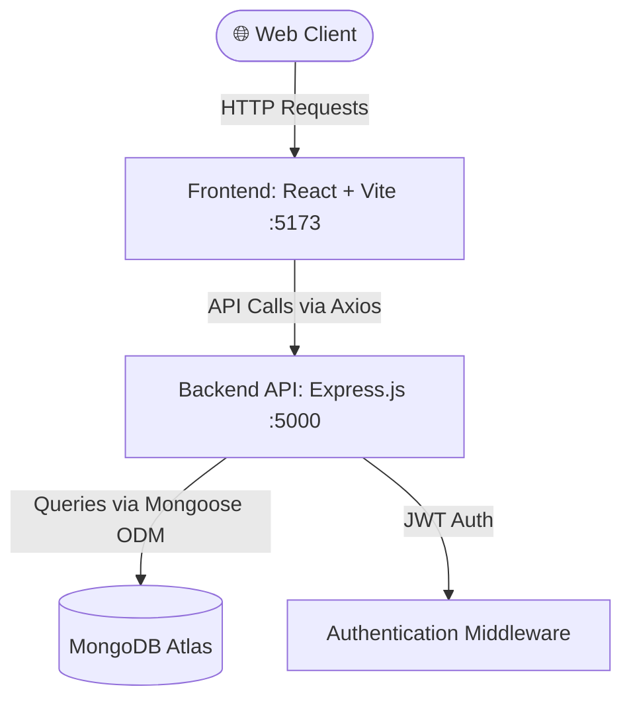
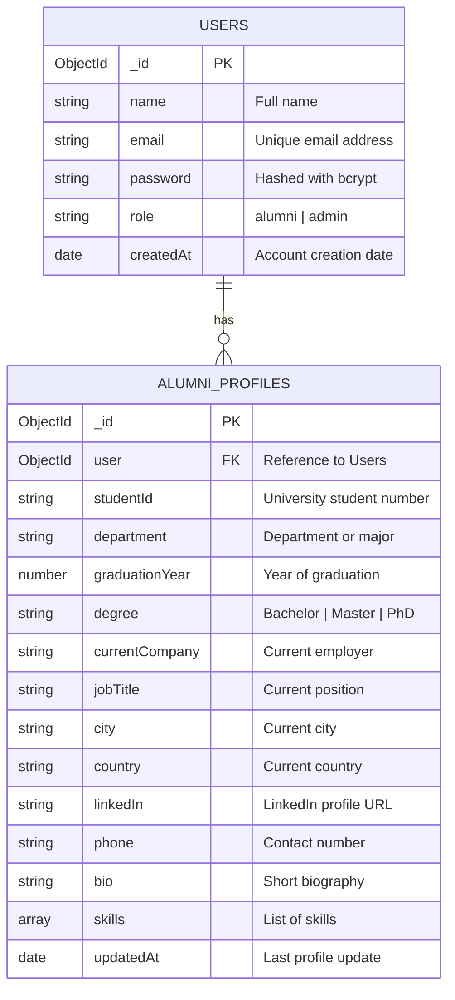

# 🎓 Alumni Tracker

A modern, containerized full-stack web application for tracking and managing university alumni. Built as a course project for **Web Programming** at Istanbul Yeni Yüzyıl University — Information Systems (YBS), 3rd Year.

---

## 🚀 Key Features & Modules

- **👤 Alumni Profiles & Career Tracking**:
  - Detailed professional profiles with current company, role, industry, and skills.
  - Academic history (graduation year, department, degree, student ID).
  - LinkedIn and portfolio integration.
- **🔍 Advanced Search & Directory**:
  - Filter alumni by graduation year, department, company, or location.
  - Paginated results with real-time search.
- **🔐 Authentication & Authorization**:
  - JWT-based secure registration and login.
  - Role-based access control (Admin / Alumni).
- **📊 Admin Dashboard**:
  - Manage all alumni records, view statistics, and generate reports.
  - User role management and verification workflows.
- **💼 Profile Management**:
  - Alumni can update their own profile and employment information.

### Planned Features
- [ ] Event management for alumni reunions
- [ ] Messaging system between alumni
- [ ] Data visualization and analytics dashboard
- [ ] Export alumni data (CSV/PDF)
- [ ] Email notifications for events and updates

---

## 🛠️ Tech Stack

| Layer | Technology | Description |
| :--- | :--- | :--- |
| **Backend** | **Node.js** + **Express.js** | High-performance RESTful API with modular route architecture. |
| **Database** | **MongoDB** (Atlas) | Flexible NoSQL document database for alumni and user data. |
| **ODM** | **Mongoose** | Schema-based data modeling and validation for MongoDB. |
| **Frontend** | **React.js** + **Vite** | Fast, modern SPA with component-based UI and hot module replacement. |
| **Auth** | **JWT** + **bcrypt** | Secure token-based authentication with hashed passwords. |
| **Containerization** | **Docker** & **Docker Compose** | Reproducible development environment with volume sync. |
| **Dev Tools** | **Nodemon** (legacy watch) | Auto-restart server on file changes inside Docker containers. |

---

## 🏛️ System Architecture



---

## 📁 Project Structure

```text
Alumni/
├── docker-compose.yml          # Multi-container orchestration
├── Dockerfile                  # Docker image definition (Node 18 Alpine)
├── .dockerignore               # Files excluded from Docker build
├── .gitignore
├── README.md
│
├── client/                     # Frontend (React + Vite)
│   ├── public/
│   ├── src/
│   │   ├── assets/             # Images, icons, static files
│   │   ├── components/         # Reusable UI components
│   │   │   ├── Navbar.jsx
│   │   │   ├── Footer.jsx
│   │   │   ├── AlumniCard.jsx
│   │   │   └── SearchBar.jsx
│   │   ├── pages/              # Page components
│   │   │   ├── Home.jsx
│   │   │   ├── Login.jsx
│   │   │   ├── Register.jsx
│   │   │   ├── Dashboard.jsx
│   │   │   ├── Profile.jsx
│   │   │   └── AlumniList.jsx
│   │   ├── context/            # React Context for state management
│   │   ├── services/           # API service functions (Axios)
│   │   ├── utils/              # Helper functions
│   │   ├── App.jsx
│   │   ├── App.css
│   │   └── main.jsx
│   ├── package.json
│   └── vite.config.js
│
└── server/                     # Backend (Node.js + Express)
    ├── config/
    │   └── db.js               # MongoDB connection configuration
    ├── controllers/            # Route handler logic
    │   ├── authController.js
    │   ├── alumniController.js
    │   └── adminController.js
    ├── middleware/
    │   ├── auth.js             # JWT authentication middleware
    │   └── errorHandler.js     # Global error handling
    ├── models/                 # Mongoose schemas
    │   ├── User.js
    │   └── Alumni.js
    ├── routes/                 # API route definitions
    │   ├── authRoutes.js
    │   ├── alumniRoutes.js
    │   └── adminRoutes.js
    ├── utils/                  # Helper utilities
    ├── .env                    # Environment variables (not committed)
    ├── server.js               # Entry point
    └── package.json
```

---

## 🗄️ Database Schema (MongoDB)



---

## 📡 API Endpoints

### Authentication
| Method | Endpoint | Description |
| :--- | :--- | :--- |
| `POST` | `/api/auth/register` | Register a new user |
| `POST` | `/api/auth/login` | Login and receive JWT token |
| `GET` | `/api/auth/me` | Get current logged-in user |

### Alumni
| Method | Endpoint | Description |
| :--- | :--- | :--- |
| `GET` | `/api/alumni` | Get all alumni (with pagination) |
| `GET` | `/api/alumni/:id` | Get a single alumni by ID |
| `POST` | `/api/alumni` | Create a new alumni record |
| `PUT` | `/api/alumni/:id` | Update an alumni record |
| `DELETE` | `/api/alumni/:id` | Delete an alumni record |
| `GET` | `/api/alumni/search?q=` | Search alumni by name/department |

### Admin
| Method | Endpoint | Description |
| :--- | :--- | :--- |
| `GET` | `/api/admin/stats` | Get dashboard statistics |
| `GET` | `/api/admin/users` | Get all registered users |
| `PUT` | `/api/admin/users/:id/role` | Update user role |

### Utility
| Method | Endpoint | Description |
| :--- | :--- | :--- |
| `GET` | `/` | Health check — returns `ok` |
| `GET` | `/hello/:name` | Returns `Hello,{name}!` |
| `GET` | `/sum/:num1/:num2` | Returns sum of two numbers |

---

## ⚡ Getting Started

### Prerequisites
- [Docker Desktop](https://www.docker.com/products/docker-desktop/) (includes Docker Engine & Docker Compose)
- [Git](https://git-scm.com/)

### 1. Clone & Configure Environment
```bash
git clone https://github.com/mehmetrasid0/Alumni.git
cd Alumni
```

Create a `.env` file in the `server/` directory:
```env
PORT=5000
MONGODB_URI=mongodb+srv://your_connection_string
JWT_SECRET=your_secret_key
NODE_ENV=development
```

### 2. Run with Docker Compose
Start the backend with a single command:
```bash
docker compose up -d --build
```

### 3. Service Endpoints
- **Backend API**: [http://localhost:5000](http://localhost:5000)
- **Health Check**: [http://localhost:5000/](http://localhost:5000/) → `ok`

### 4. Useful Commands
```bash
docker logs alumni          # View container logs
docker restart alumni       # Restart the container
docker compose down         # Stop and remove containers
```

> **💡 Live Reload:** The `server/` directory is mounted as a volume. Code changes are automatically reflected inside the container thanks to **nodemon** with legacy watch mode — no rebuild needed!

### Alternative: Run Without Docker
```bash
cd server
npm install
npm run dev
```

---

## 🗺️ Roadmap

- [x] **Phase 1: Environment & Architecture Setup**
  - Set up repository structure and README documentation.
  - Configure `Dockerfile` and `docker-compose.yml` with Node.js.
  - Initialize Express server with basic utility routes.
- [ ] **Phase 2: Database & Authentication**
  - Set up MongoDB connection with Mongoose ODM.
  - Implement JWT-based auth (Register, Login, Role-based guards).
  - Password hashing with bcrypt.
- [ ] **Phase 3: Core API Development**
  - CRUD operations for Alumni profiles.
  - Admin routes and middleware.
  - Search and pagination endpoints.
- [ ] **Phase 4: Frontend & UI**
  - Build responsive pages with React + Vite.
  - Implement searchable alumni directory with filters.
  - Login, Registration, and Profile pages.
  - Admin dashboard with statistics.
- [ ] **Phase 5: Integration & Testing**
  - Connect frontend with backend API via Axios.
  - API testing with Postman.
- [ ] **Phase 6: Deployment & CI/CD**
  - Production Docker builds.
  - Deploy to cloud platform.

---

## 🤝 Contributing

This is a university course project. Contributions are welcome for learning purposes.

1. Fork the repository
2. Create your feature branch (`git checkout -b feature/amazing-feature`)
3. Commit your changes (`git commit -m 'Add some amazing feature'`)
4. Push to the branch (`git push origin feature/amazing-feature`)
5. Open a Pull Request

---

## 📄 License

This project is licensed under the MIT License. See the [LICENSE](LICENSE) file for details.

---

## 👤 Author

**Mehmet Raşid** — Istanbul Yeni Yüzyıl University, Information Systems (YBS), 3rd Year

- GitHub: [@mehmetrasid0](https://github.com/mehmetrasid0)

---

<p align="center">
  Made with ❤️ for Web Programming Course — 2026
</p>
