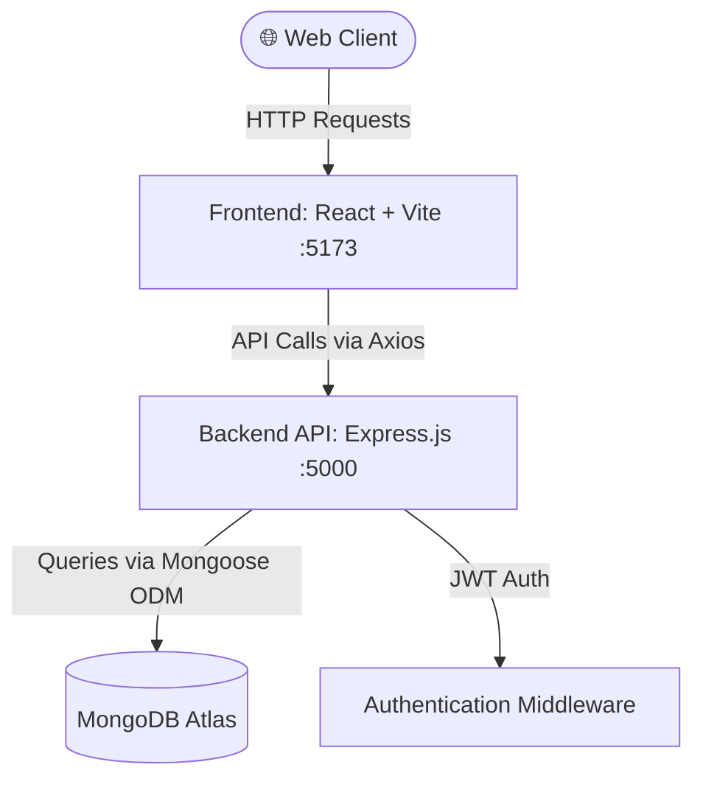
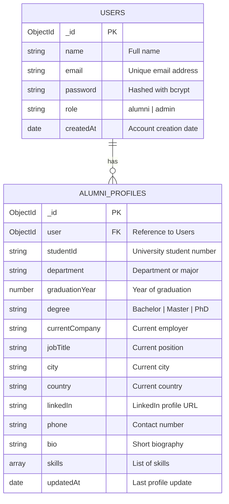

# 🎓 Alumni Tracker

A modern, containerized full-stack web application for tracking and managing university alumni. Built as a course project for **Web Programming** at Istanbul Yeni Yüzyıl University — Information Systems (YBS), 3rd Year.

---

## 🚀 Key Features & Modules

- **👤 Alumni Profiles & Career Tracking**:
  - Detailed professional profiles with current company, role, industry, and skills.
  - Academic history (graduation year, department, degree, student ID).
  - LinkedIn and portfolio integration.
- **🔍 Advanced Search & Directory**:
  - Filter alumni by graduation year, department, company, or location.
  - Paginated results with real-time search.
- **🔐 Authentication & Authorization**:
  - JWT-based secure registration and login.
  - Role-based access control (Admin / Alumni).
- **📊 Admin Dashboard**:
  - Manage all alumni records, view statistics, and generate reports.
  - User role management and verification workflows.
- **💼 Profile Management**:
  - Alumni can update their own profile and employment information.

### Planned Features
- [ ] Event management for alumni reunions
- [ ] Messaging system between alumni
- [ ] Data visualization and analytics dashboard
- [ ] Export alumni data (CSV/PDF)
- [ ] Email notifications for events and updates

---

## 🛠️ Tech Stack

| Layer | Technology | Description |
| :--- | :--- | :--- |
| **Backend** | **Node.js** + **Express.js** | High-performance RESTful API with modular route architecture. |
| **Database** | **MongoDB** (Atlas) | Flexible NoSQL document database for alumni and user data. |
| **ODM** | **Mongoose** | Schema-based data modeling and validation for MongoDB. |
| **Frontend** | **React.js** + **Vite** | Fast, modern SPA with component-based UI and hot module replacement. |
| **Auth** | **JWT** + **bcrypt** | Secure token-based authentication with hashed passwords. |
| **Containerization** | **Docker** & **Docker Compose** | Reproducible development environment with volume sync. |
| **Dev Tools** | **Nodemon** (legacy watch) | Auto-restart server on file changes inside Docker containers. |

---

## 🏛️ System Architecture


```mermaid
graph TD
    User(["🌐 Web Client"]) -->|HTTP Requests| Frontend["Frontend: React + Vite :5173"]
    Frontend -->|API Calls via Axios| Backend["Backend API: Express.js :5000"]
    Backend -->|Queries via Mongoose ODM| DB[("MongoDB Atlas")]
    Backend -->|JWT Auth| Auth["Authentication Middleware"]
```

---

## 📁 Project Structure

```text
Alumni/
├── docker-compose.yml          # Multi-container orchestration
├── Dockerfile                  # Docker image definition (Node 18 Alpine)
├── .dockerignore               # Files excluded from Docker build
├── .gitignore
├── README.md
│
├── client/                     # Frontend (React + Vite)
│   ├── public/
│   ├── src/
│   │   ├── assets/             # Images, icons, static files
│   │   ├── components/         # Reusable UI components
│   │   │   ├── Navbar.jsx
│   │   │   ├── Footer.jsx
│   │   │   ├── AlumniCard.jsx
│   │   │   └── SearchBar.jsx
│   │   ├── pages/              # Page components
│   │   │   ├── Home.jsx
│   │   │   ├── Login.jsx
│   │   │   ├── Register.jsx
│   │   │   ├── Dashboard.jsx
│   │   │   ├── Profile.jsx
│   │   │   └── AlumniList.jsx
│   │   ├── context/            # React Context for state management
│   │   ├── services/           # API service functions (Axios)
│   │   ├── utils/              # Helper functions
│   │   ├── App.jsx
│   │   ├── App.css
│   │   └── main.jsx
│   ├── package.json
│   └── vite.config.js
│
└── server/                     # Backend (Node.js + Express)
    ├── config/
    │   └── db.js               # MongoDB connection configuration
    ├── controllers/            # Route handler logic
    │   ├── authController.js
    │   ├── alumniController.js
    │   └── adminController.js
    ├── middleware/
    │   ├── auth.js             # JWT authentication middleware
    │   └── errorHandler.js     # Global error handling
    ├── models/                 # Mongoose schemas
    │   ├── User.js
    │   └── Alumni.js
    ├── routes/                 # API route definitions
    │   ├── authRoutes.js
    │   ├── alumniRoutes.js
    │   └── adminRoutes.js
    ├── utils/                  # Helper utilities
    ├── .env                    # Environment variables (not committed)
    ├── server.js               # Entry point
    └── package.json
```

---

## 🗄️ Database Schema (MongoDB)


```mermaid
erDiagram
    USERS ||--o{ ALUMNI_PROFILES : has
    USERS {
        ObjectId _id PK
        string name "Full name"
        string email "Unique email address"
        string password "Hashed with bcrypt"
        string role "alumni | admin"
        date createdAt "Account creation date"
    }

    ALUMNI_PROFILES {
        ObjectId _id PK
        ObjectId user FK "Reference to Users"
        string studentId "University student number"
        string department "Department or major"
        number graduationYear "Year of graduation"
        string degree "Bachelor | Master | PhD"
        string currentCompany "Current employer"
        string jobTitle "Current position"
        string city "Current city"
        string country "Current country"
        string linkedIn "LinkedIn profile URL"
        string phone "Contact number"
        string bio "Short biography"
        array skills "List of skills"
        date updatedAt "Last profile update"
    }
```

---

## 📡 API Endpoints

### 📘 Swagger API Dokümantasyonu

Tüm API endpoint'lerini interaktif olarak keşfetmek, test etmek ve detaylı şemalarını görmek için **Swagger UI** kullanılabilir:

| Kaynak | URL | Açıklama |
| :--- | :--- | :--- |
| **Swagger UI** | [`/api/swagger`](http://localhost:5000/api/swagger) | İnteraktif API dokümantasyonu — Try it out ile doğrudan test edin |
| **Swagger JSON** | [`/api/swagger.json`](http://localhost:5000/api/swagger.json) | OpenAPI 3.0 spesifikasyonu (JSON formatında) |

> **💡 İpucu:** Swagger UI üzerinde her endpoint'in yanındaki **"Try it out"** butonuna tıklayarak doğrudan tarayıcıdan API istekleri gönderebilirsiniz.

#### Swagger Üzerinden Test Adımları
1. Tarayıcıda [`http://localhost:5000/api/swagger`](http://localhost:5000/api/swagger) adresini açın
2. Test etmek istediğiniz endpoint'i genişletin
3. **"Try it out"** butonuna tıklayın
4. Gerekli parametreleri doldurun
5. **"Execute"** butonuna tıklayın
6. Response kısmında sonucu görün

### Health Check
| Method | Endpoint | Açıklama |
| :--- | :--- | :--- |
| `GET` | `/api/health` | Kapsamlı sistem sağlık durumu (CPU, bellek, OS, runtime bilgileri) |

### Users (CRUD)
| Method | Endpoint | Açıklama | Body Formatları |
| :--- | :--- | :--- | :--- |
| `GET` | `/api/users` | Tüm kullanıcıları listele | — |
| `GET` | `/api/users/:id` | Tek kullanıcı getir | — |
| `POST` | `/api/users` | Yeni kullanıcı ekle | JSON, form-data, x-www-form-urlencoded |
| `PUT` | `/api/users/:id` | Kullanıcıyı tamamen güncelle | JSON, form-data, x-www-form-urlencoded |
| `PATCH` | `/api/users/:id` | Kullanıcıyı kısmi güncelle | JSON, form-data, x-www-form-urlencoded |
| `DELETE` | `/api/users/:id` | Kullanıcı sil | — |

### Utility
| Method | Endpoint | Açıklama |
| :--- | :--- | :--- |
| `GET` | `/hello/:name` | `Hello,{name}!` selamlama mesajı döndürür |
| `GET` | `/sum/:num1/:num2` | İki sayının toplamını döndürür |

### Pages
| Method | Endpoint | Açıklama |
| :--- | :--- | :--- |
| `GET` | `/` | Ana sayfa (index.html) |
| `GET` | `/about` | Hakkında sayfası (about.html) |
| `GET` | `/alumni` | Mezunlar arayüzü (alumni.html) |
| `GET` | `/api/swagger` | Swagger UI — İnteraktif API dokümantasyonu |

### Örnek API İstekleri

#### Tüm Kullanıcıları Listele
```bash
curl http://localhost:5000/api/users
```

#### Yeni Kullanıcı Ekle (JSON)
```bash
curl -X POST http://localhost:5000/api/users \
  -H "Content-Type: application/json" \
  -d '{"name":"Ali Vural","email":"ali@alumni.edu","graduationYear":2023,"department":"Yazılım Mühendisliği","company":"SAP","role":"Backend Developer"}'
```

#### Kullanıcı Kısmi Güncelle (PATCH)
```bash
curl -X PATCH http://localhost:5000/api/users/1 \
  -H "Content-Type: application/json" \
  -d '{"company":"Tesla","role":"Senior Engineer"}'
```

#### Kullanıcı Sil
```bash
curl -X DELETE http://localhost:5000/api/users/1
```

---

## ⚡ Getting Started

### Prerequisites
- [Docker Desktop](https://www.docker.com/products/docker-desktop/) (includes Docker Engine & Docker Compose)
- [Git](https://git-scm.com/)

### 1. Clone & Configure Environment
```bash
git clone https://github.com/mehmetrasid0/Alumni.git
cd Alumni
```

Create a `.env` file in the `server/` directory:
```env
PORT=5000
MONGODB_URI=mongodb+srv://your_connection_string
JWT_SECRET=your_secret_key
NODE_ENV=development
```

### 2. Run with Docker Compose
Start the backend with a single command:
```bash
docker compose up -d --build
```

### 3. Service Endpoints
- **Backend API**: [http://localhost:5000](http://localhost:5000)
- **Swagger UI**: [http://localhost:5000/api/swagger](http://localhost:5000/api/swagger) — İnteraktif API dokümantasyonu
- **Swagger JSON**: [http://localhost:5000/api/swagger.json](http://localhost:5000/api/swagger.json)
- **Health Check**: [http://localhost:5000/api/health](http://localhost:5000/api/health)
- **Mezunlar Arayüzü**: [http://localhost:5000/alumni](http://localhost:5000/alumni)

### 4. Useful Commands
```bash
docker logs alumni          # View container logs
docker restart alumni       # Restart the container
docker compose down         # Stop and remove containers
```

> **💡 Live Reload:** The `server/` directory is mounted as a volume. Code changes are automatically reflected inside the container thanks to **nodemon** with legacy watch mode — no rebuild needed!

### Alternative: Run Without Docker
```bash
cd server
npm install
npm run dev
```

---

## 🗺️ Roadmap

- [x] **Phase 1: Environment & Architecture Setup**
  - Set up repository structure and README documentation.
  - Configure `Dockerfile` and `docker-compose.yml` with Node.js.
  - Initialize Express server with basic utility routes.
- [ ] **Phase 2: Database & Authentication**
  - Set up MongoDB connection with Mongoose ODM.
  - Implement JWT-based auth (Register, Login, Role-based guards).
  - Password hashing with bcrypt.
- [ ] **Phase 3: Core API Development**
  - CRUD operations for Alumni profiles.
  - Admin routes and middleware.
  - Search and pagination endpoints.
- [ ] **Phase 4: Frontend & UI**
  - Build responsive pages with React + Vite.
  - Implement searchable alumni directory with filters.
  - Login, Registration, and Profile pages.
  - Admin dashboard with statistics.
- [ ] **Phase 5: Integration & Testing**
  - Connect frontend with backend API via Axios.
  - API testing with Postman.
- [ ] **Phase 6: Deployment & CI/CD**
  - Production Docker builds.
  - Deploy to cloud platform.

---

## 🤝 Contributing

This is a university course project. Contributions are welcome for learning purposes.

1. Fork the repository
2. Create your feature branch (`git checkout -b feature/amazing-feature`)
3. Commit your changes (`git commit -m 'Add some amazing feature'`)
4. Push to the branch (`git push origin feature/amazing-feature`)
5. Open a Pull Request

---

## 📄 License

This project is licensed under the MIT License. See the [LICENSE](LICENSE) file for details.

---

## 👤 Author

**Mehmet Raşid** — Istanbul Yeni Yüzyıl University, Information Systems (YBS), 3rd Year

- GitHub: [@mehmetrasid0](https://github.com/mehmetrasid0)

---

<p align="center">
  Made with ❤️ for Web Programming Course — 2026
</p>
