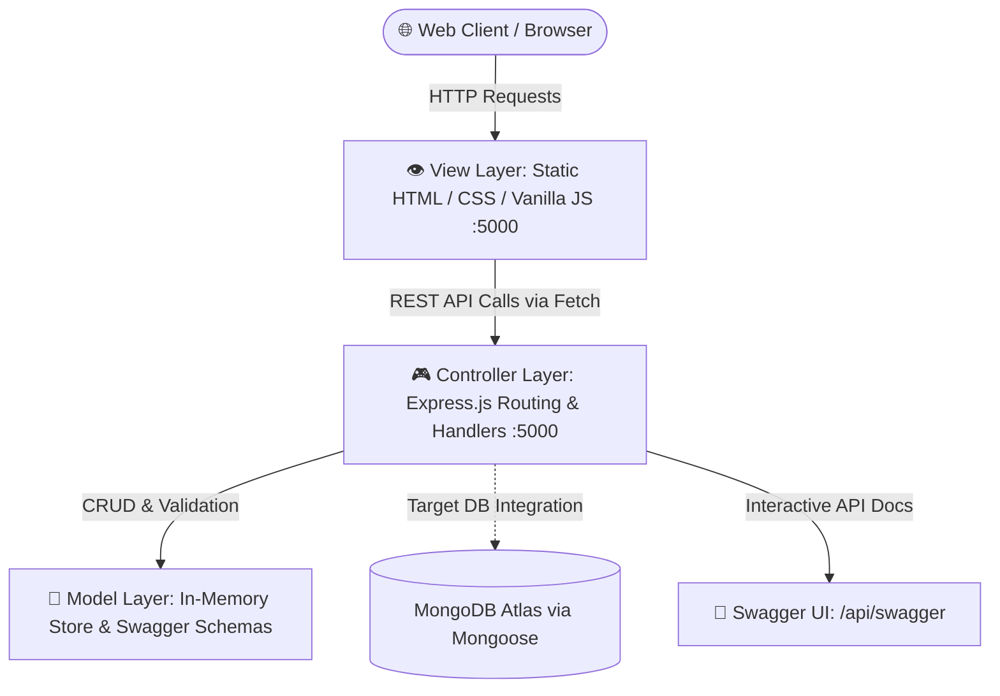
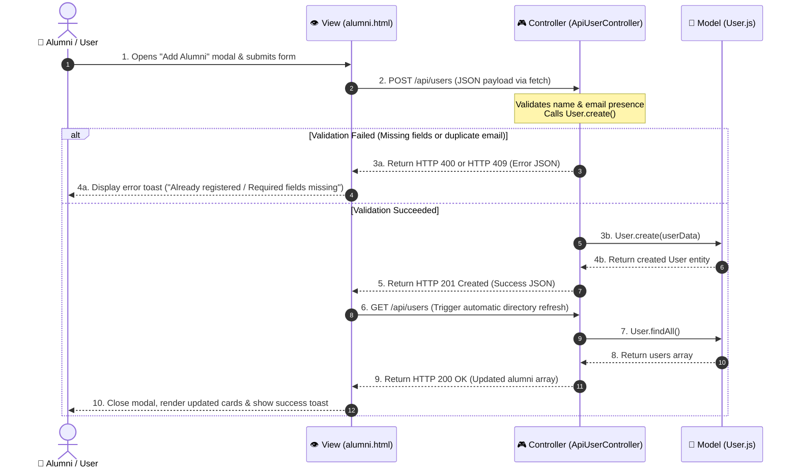
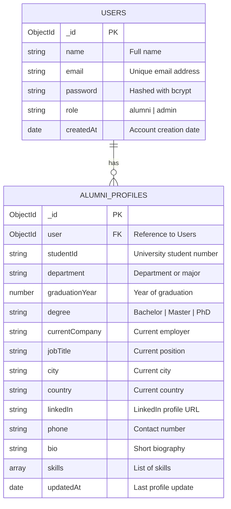

# 🎓 Alumni Tracker

A modern, containerized full-stack web application for tracking and managing university alumni. Built as a course project for **Web Programming** at Istanbul University — Management Information Systems (YBS), 3rd Year.

---

## 🚀 Key Features & Modules

- **👤 Alumni Profiles & Career Tracking**:
  - Detailed professional profiles with current company, role, industry, and skills.
  - Academic history (graduation year, department, degree, student ID).
  - LinkedIn and portfolio integration.
- **🔍 Advanced Search & Directory**:
  - Filter alumni by graduation year, department, company, or location.
  - Dynamic results with real-time client-side search.
- **🔐 Authentication & Authorization**:
  - JWT-based secure registration and login (Planned).
  - Role-based access control (Admin / Alumni).
- **📊 Admin Dashboard**:
  - Manage all alumni records, view statistics, and generate reports.
  - User role management and verification workflows.
- **💼 Profile Management**:
  - Alumni can update their own profile and employment information.

### Planned Features
- [ ] Event management for alumni reunions
- [ ] Messaging system between alumni
- [ ] Data visualization and analytics dashboard
- [ ] Export alumni data (CSV/PDF)
- [ ] Email notifications for events and updates

---

## 🛠️ Tech Stack

| Layer | Technology | Description |
| :--- | :--- | :--- |
| **Backend** | **Node.js** + **Express.js** | High-performance RESTful API with modular route architecture. |
| **Database** | **MongoDB** (Atlas) | Flexible NoSQL document database for alumni and user data (Planned). |
| **ODM** | **Mongoose** | Schema-based data modeling and validation for MongoDB (Planned). |
| **Frontend** | **HTML5** + **CSS3** + **Vanilla JS (ES6+)** | Responsive, accessible UI with real-time filtering (React + Vite planned for Phase 7). |
| **Documentation** | **Swagger UI** + **OpenAPI 3.0** | Interactive API documentation and in-browser testing portal. |
| **Containerization** | **Docker** & **Docker Compose** | Reproducible development environment with volume synchronization. |
| **Dev Tools** | **Nodemon** (legacy watch) | Auto-restart server on file changes inside Docker containers. |
| **Testing** | **Postman Collection** | Preconfigured automated test suite for all REST API endpoints. |

---

## 📌 Quick Overview & Instructor Evaluation Guide

| Verification Item | Direct Link / Resource | Description |
| :--- | :--- | :--- |
| ⭐ **This Week (W4)** | [Week 4 — MVC Architecture & Postman](#-week-4-w4--october-07-2026-this-week--current-week-) | Comprehensive MVC breakdown, directory map, and automated test suite |
| 👁️ **Live UI (View)** | [`http://localhost:5000/alumni`](http://localhost:5000/alumni) | Interactive alumni search, multi-filter directory, and creation modal |
| 📘 **Swagger UI (Docs/Model)** | [`http://localhost:5000/api/swagger`](http://localhost:5000/api/swagger) | Interactive OpenAPI 3.0 API documentation & live testing portal |
| 🩺 **Health Check (Controller)**| [`http://localhost:5000/api/health`](http://localhost:5000/api/health) | Real-time CPU load, memory utilization, OS details, and server uptime |
| 📮 **Postman Test Suite** | [`postman/Alumni_Tracker_API.postman_collection.json`](./postman/Alumni_Tracker_API.postman_collection.json) | One-click importable Postman collection containing 14 automated API requests |
| 🏗️ **MVC Architecture** | [MVC Architecture Specification](#-mvc-architecture-model---view---controller) | Detailed technical breakdown of Model, View, and Controller layers |
| 📁 **File & Directory Map** | [Project Directory, Folder & File Structure](#-project-directories-folders--files-structure) | Full mapping of project files to their respective MVC roles |

---

## 📅 Weekly Development Progress Tracker (W1 — W4)

This project is developed in weekly milestones throughout the academic semester. The breakdown below details goals, completed work, affected files, and commit references based on the Git commit history:

| Week | Date Range | Focus & Deliverables | Git Commits | Status |
| :--- | :--- | :--- | :--- | :--- |
| **W1** | Sep 22 – 23, 2026 | Project Kickoff, Docker Containerization & Express Foundation | `d76cbcb`, `54eeece`, `6b9af53` | ✅ Completed |
| **W2** | Sep 23 – 29, 2026 | View Layer Foundation, Institutional UI (Home & About), Design System | `e612c51` | ✅ Completed |
| **W3** | Sep 30, 2026 | RESTful API (Users CRUD), Health Telemetry, Swagger UI, Alumni UI | `cd6b3ef` | ✅ Completed |
| **W4** | **Oct 07, 2026** | **MVC Architecture Formalization, File Map, Postman Test Suite & Blueprint** | `88f15e5` | 🚀 **This Week (Active)** |

---

### 📦 Week 1 (W1) — September 22–23, 2026: Project Kickoff & Infrastructure
* **Objective**: Establish the core infrastructure for the Alumni Tracker platform, configure containerization via Docker, and draft initial project documentation.
* **Commits**:
  * [`d76cbcb`](https://github.com/mehmetrasid0/Alumni/commit/d76cbcb) — *Initial commit: Add README and project documentation*
  * [`54eeece`](https://github.com/mehmetrasid0/Alumni/commit/54eeece) — *feat: add Docker Compose setup and Express server with basic routes*
  * [`6b9af53`](https://github.com/mehmetrasid0/Alumni/commit/6b9af53) — *docs: redesign README with mermaid diagrams, ER schema, and phased roadmap*
* **Accomplishments**:
  1. Initialized Git repository with clean `.gitignore` rule configurations.
  2. Configured containerization using `Dockerfile` (Node.js 18 Alpine) and `docker-compose.yml` with live volume reload.
  3. Initialized Express.js HTTP backend server with foundational utility routes (`GET /hello/:name`, `GET /sum/:number1/:number2`).
  4. Designed preliminary Entity-Relationship (ER) schema for MongoDB Atlas and established a multi-phased development roadmap.
* **Related Files**: `Dockerfile`, `docker-compose.yml`, `.dockerignore`, `server/server.js`, `README.md`.

---

### 🎨 Week 2 (W2) — September 23–29, 2026: View Layer & Institutional Web UI
* **Objective**: Build responsive, professional frontend views for the application landing page and institutional about page.
* **Commits**:
  * [`e612c51`](https://github.com/mehmetrasid0/Alumni/commit/e612c51) — *feat: add homepage UI and about page with developer info*
* **Accomplishments**:
  1. **Landing Page (`server/public/index.html`)**: Designed greeting hero banner, real-time platform statistics counters, feature highlight cards, and call-to-action buttons.
  2. **About Page (`server/public/about.html`)**: Authored academic project overview for Istanbul University (Management Information Systems / YBS, 3rd Year), vision, mission, and developer biography.
  3. **Global Design System (`server/public/css/style.css`)**: Built unified CSS design tokens utilizing an institutional Navy (`--navy-900`) and Gold (`--gold-400`) palette, typography scale, responsive CSS Grid/Flexbox layouts, and mobile drawer navigation.
  4. Configured static asset delivery using Express static middleware (`express.static('public')`).
* **Related Files**: `server/public/index.html`, `server/public/about.html`, `server/public/css/style.css`, `server/server.js`.

---

### ⚡ Week 3 (W3) — September 30, 2026: RESTful API, Health Telemetry, Swagger & Alumni Dashboard
* **Objective**: Implement a full-featured RESTful CRUD API for alumni management, integrate Swagger documentation, and construct an interactive client-side alumni directory.
* **Commits**:
  * [`cd6b3ef`](https://github.com/mehmetrasid0/Alumni/commit/cd6b3ef) — *feat: Swagger API docs, health endpoint, users CRUD, alumni UI*
* **Accomplishments**:
  1. **Users RESTful CRUD API**:
     * `GET /api/users` (List all alumni records)
     * `GET /api/users/:id` (Fetch single user by ID)
     * `POST /api/users` (Add new alumni record with email uniqueness validation)
     * `PUT /api/users/:id` (Full record update with mandatory field enforcement)
     * `PATCH /api/users/:id` (Partial field update preserving entity identity)
     * `DELETE /api/users/:id` (Remove record from data store)
  2. **Multipart & Form Parsing**: Integrated `multer` middleware alongside standard body parsers to support `application/json`, `multipart/form-data`, and `application/x-www-form-urlencoded`.
  3. **System Telemetry & Health Check (`GET /api/health`)**: Built comprehensive hardware telemetry endpoint reporting per-core CPU load, system and process RAM usage, operating system details, and uptime with health status classification (`healthy`, `warning`, `critical`).
  4. **Swagger UI Portal (`/api/swagger`)**: Integrated OpenAPI 3.0 specification (`swagger.js`) providing browser-based interactive API testing with "Try it out" capability.
  5. **Interactive Alumni Dashboard (`server/public/alumni.html`)**:
     * Real-time client-side search across names, companies, roles, and emails.
     * Reactive dropdown filtering by academic department and graduation year.
     * Dynamic DOM card rendering engine with automated avatar initials generation.
     * Asynchronous modal dialog for adding new alumni records using `fetch()`.
     * Instant toast notification feedback system.
* **Related Files**: `server/server.js`, `server/swagger.js`, `server/public/alumni.html`, `server/public/css/style.css`, `server/package.json`.

---

### 🚀 Week 4 (W4) — October 07, 2026 (THIS WEEK / CURRENT WEEK ⭐)
* **Objective**: Formalize the **Model-View-Controller (MVC)** architectural pattern, document directory/folder/file responsibilities, produce end-to-end request lifecycle diagrams, build a standardized Postman API test suite, and organize the repository layout.
* **Focus**: Architectural Integrity, Layer Separation (MVC), Test Automation & Clean Project Template
* **This Week's Accomplishments (Instructor Evaluation Checklist)**:
  1. **Comprehensive MVC Architecture Implementation & Documentation**:
     * **Model Layer (`server/models/User.js` & `server/swagger.js`)**: Built standalone in-memory `User` Model class with full CRUD methods (`findAll`, `findById`, `findByEmail`, `create`, `update`, `delete`, `count`, `reset`) and business validation rules without requiring an external database connection.
     * **Controller Layer (`server/controllers/`)**: Built two specialized controllers:
       * `UserController.js`: Web view and form lifecycle controller (`home`, `about`, `index`, `show`, `store`, `update`, `destroy`).
       * `ApiUserController.js`: RESTful JSON API controller (`getAll`, `getById`, `create`, `update`, `patch`, `delete`).
     * **Routing Layer (`server/routes/`)**: Modularized Express routing:
       * `userRoutes.js`: Web client routes mapped to `UserController`.
       * `apiUserRoutes.js`: RESTful API routes mounted at `/api/users` mapped to `ApiUserController`.
     * **View Layer (`server/public/`)**: Documented client presentation assets (`index.html`, `about.html`, `alumni.html`), design system tokens (`css/style.css`), and Swagger UI.
     * **Swagger Specification (`server/swagger.js`)**: Updated OpenAPI 3.0 specification to 100% English, fully covering all RESTful API endpoints and web user form handlers.
  2. **Directory, Folder & File Architecture Map**:
     * Mapped every file in the repository to its architectural role (`[Model]`, `[View]`, `[Controller]`, `[Routing]`, `[DevOps]`, `[Config]`, `[Testing]`) and formulated an exhaustive Component Responsibility Matrix.
  3. **Mermaid Flow & Sequence Diagrams**:
     * High-level MVC interaction diagram illustrating decoupled layer communications.
     * 10-step sequence diagram tracing user submission in the View $\rightarrow$ `ApiUserController` $\rightarrow$ `User` Model $\rightarrow$ HTTP response $\rightarrow$ DOM update in the View.
  4. **Postman API Test Collection**:
     * Authored and exported [`postman/Alumni_Tracker_API.postman_collection.json`](./postman/Alumni_Tracker_API.postman_collection.json) containing 14 ready-to-execute automated requests covering CRUD, Health Telemetry, Utilities, and Web Pages.
  5. **Modular MVC Project Template**:
     * Integrated dedicated `models/`, `controllers/`, and `routes/` directories into the codebase, migrating route handlers from monolithic `server.js` while maintaining full application stability.
* **Evaluation Reference Links**:
  * 📖 **MVC Specification**: [🏗️ MVC Architecture](#-mvc-architecture-model---view---controller)
  * 📁 **Directory Map**: [📁 Project Directories, Folders & Files Structure](#-project-directories-folders--files-structure)
  * 🌐 **Live Web UI**: [`http://localhost:5000/alumni`](http://localhost:5000/alumni)
  * 📘 **Swagger UI**: [`http://localhost:5000/api/swagger`](http://localhost:5000/api/swagger)
  * 🩺 **Health Telemetry**: [`http://localhost:5000/api/health`](http://localhost:5000/api/health)
  * 📮 **Postman Test Suite**: [`postman/Alumni_Tracker_API.postman_collection.json`](./postman/Alumni_Tracker_API.postman_collection.json)

---

## 🏛️ System Architecture


```mermaid
graph TD
    User(["🌐 Web Client / Browser"]) -->|HTTP Requests| View["👁️ View Layer: Static HTML / CSS / Vanilla JS :5000"]
    View -->|REST API Calls via Fetch| Controller["🎮 Controller Layer: Express.js Routing & Handlers :5000"]
    Controller -->|CRUD & Validation| Model["🧠 Model Layer: In-Memory Store & Swagger Schemas"]
    Controller -.->|Target DB Integration| DB[("MongoDB Atlas via Mongoose")]
    Controller -->|Interactive API Docs| SwaggerUI["📘 Swagger UI: /api/swagger"]
```

---

## 🏗️ MVC Architecture (Model - View - Controller)

The **Alumni Tracker** application is designed following the **Model-View-Controller (MVC)** architectural pattern. This pattern separates the application into three interconnected components, decoupling internal representations of information from the ways that information is presented to and accepted from the user.

```mermaid
graph TD
    subgraph VIEW_LAYER ["👁️ VIEW LAYER (Client Presentation)"]
        V_Home["index.html<br/>(Landing Page)"]
        V_About["about.html<br/>(About Page)"]
        V_Alumni["alumni.html<br/>(Alumni Directory & Form)"]
        V_CSS["css/style.css<br/>(Design Tokens & Layout)"]
        V_Swagger["Swagger UI<br/>(/api/swagger)"]
    end

    subgraph CONTROLLER_LAYER ["🎮 CONTROLLER LAYER (Application Logic)"]
        C_Middleware["Middleware Pipeline<br/>(express.json, urlencoded, multer)"]
        C_WebCtrl["UserController<br/>(Web Pages & Form CRUD)"]
        C_ApiCtrl["ApiUserController<br/>(REST API JSON CRUD)"]
        C_Health["Diagnostics Controller<br/>(GET /api/health)"]
        C_Util["Utility Controllers<br/>(GET /hello, GET /sum)"]
    end

    subgraph MODEL_LAYER ["🧠 MODEL LAYER (Data & Schema)"]
        M_Memory["In-Memory Data Store<br/>(User Model & nextId counter)"]
        M_Validation["Business Rules & Validation<br/>(Required fields, Email uniqueness)"]
        M_Swagger["OpenAPI 3.0 Schemas<br/>(User, UserInput, UserPatch)"]
        M_TargetDB[("Future: MongoDB + Mongoose<br/>(User & Alumni Schemas)")]
    end

    User(["👤 End User"]) -->|Interacts with UI| VIEW_LAYER
    VIEW_LAYER -->|Dispatches HTTP Requests| C_Middleware
    C_Middleware --> C_WebCtrl
    C_Middleware --> C_ApiCtrl
    C_Middleware --> C_Health
    C_Middleware --> C_Util

    C_ApiCtrl -->|Queries / Validates / Modifies| M_Memory
    C_WebCtrl -->|Queries / Persists| M_Memory
    C_ApiCtrl -.->|Conforms to Schemas| M_Swagger
    C_ApiCtrl -.->|Target Persistence| M_TargetDB

    M_Memory -->|Returns State / Records| C_ApiCtrl
    M_Memory -->|Returns State / Records| C_WebCtrl
    C_ApiCtrl -->|JSON Response (200, 201, 400, 404, 409)| VIEW_LAYER
    C_WebCtrl -->|Serves HTML Pages & Form Redirects| VIEW_LAYER
    VIEW_LAYER -->|Renders Dynamic Cards & Feedback| User
```

---

### 🧠 1. Model Layer (Data & Schema Contracts)
The **Model** represents core data structures, business logic constraints, and schema validations without requiring external database connections:

* **1. User Model (`server/models/User.js` & `server/swagger.js`)**:
  * Encapsulates all data state and business validation without requiring an external database connection.
  * Implements comprehensive **CRUD methods**:
    * `findAll(filters)`: Retrieves the alumni collection with optional keyword search, department, and graduation year filtering.
    * `findById(id)`: Fetches a single user record by numeric ID.
    * `findByEmail(email)`: Queries user by email for duplicate checks and authentication.
    * `create(userData)`: Validates required fields, enforces email uniqueness, auto-increments primary ID, and timestamps creation.
    * `update(id, updateData, isPartial)`: Handles both full entity replacement (`PUT`) and selective field mutations (`PATCH`) while guarding immutable fields.
    * `delete(id)`: Removes user record from the data store by ID.
    * `count()`: Returns active total record count.
    * `reset()`: Re-initializes seed records for predictable testing.

* **2. Announcement Model (`server/models/Announcement.js` & `server/swagger.js`)**:
  * Encapsulates campus bulletins, career opportunities, event notices, and institutional updates without a database connection.
  * Entity attributes: `id`, `title`, `content`, `category` (Event, Career, Academic, Networking, General), `priority` (low, medium, high, urgent), `status` (published, draft, archived), `author`, `targetAudience`, `pinned`, `createdAt`, `updatedAt`.
  * Implements comprehensive **CRUD methods**:
    * `findAll(filters)`: Retrieves announcements sorted by pinned status and newest first, with query (`query`/`q`), category, status, and priority filtering.
    * `findById(id)`: Fetches a single announcement record by numeric ID.
    * `create(data)`: Validates mandatory title and content fields, applies default category and priority, auto-increments ID.
    * `update(id, updateData, isPartial)`: Supports full replacement (`PUT`) and selective field updates (`PATCH`).
    * `delete(id)`: Removes announcement record by ID.
    * `count(filters)`: Returns active announcement count.
    * `reset()`: Re-initializes seed announcements.

* **Schema Definition & Data Contracts (`server/swagger.js`)**:
  * Models: `User`, `UserInput`, `UserPatch`, `Announcement`, `AnnouncementInput`, `AnnouncementPatch`.
  * Response Schemas: `SuccessResponse`, `UsersListResponse`, `AnnouncementSuccessResponse`, `AnnouncementListResponse`, `ErrorResponse`.

---

### 👁️ 2. View Layer (User Interface & Presentation)
The **View** is responsible for presenting data to the user, capturing user interactions, and rendering visual feedback.

* **Current Implementation (`server/public/`)**:
  * **`index.html` (Landing View)**: Brand hero section, quick navigation, key university information, and platform statistics overview.
  * **`about.html` (Informational View)**: Project motivation, academic department curriculum context (Istanbul University YBS), and development background.
  * **`alumni.html` (Dynamic Alumni Directory View)**:
    * **Reactive Search & Filtering**: Real-time client-side search across names, emails, companies, and roles, alongside department and graduation year select filters.
    * **Card Generator Engine**: Dynamic DOM generation converting user objects into styled card components with initials avatars and metadata tags.
    * **Modal Dialog & Form Handling**: Intercepts user inputs, formats JSON payloads, and communicates asynchronously with backend endpoints via `fetch()`.
    * **Toast Notification System**: Real-time feedback alerts for successful operations or HTTP errors.
  * **`announcements.html` (Announcement Management Dashboard & Interface)**:
    * **KPI Summary Cards**: Real-time counters for Total Announcements, Published Notices, Urgent/High Priority, and Drafts.
    * **Multi-Facet Controls**: Live search filtering by title, content, or author; category filter pills (All, Event, Career, Academic, Networking, General); publication status filter pills (All, Published, Draft, Archived).
    * **Management Table & Actions**: Comprehensive grid displaying notice title, excerpt, category badge, color-coded priority pill, status tag, audience, author, and date.
    * **Direct Action Buttons**: In-line "View" (`/announcements/:id`), "Edit" (`/announcements/:id/edit`), and "Delete" with browser confirmation.
    * **Creation & Edit Modal**: Embedded responsive modal form enabling seamless in-page authoring and updates.
  * **Dedicated Server-Rendered HTML Views (`server/controllers/`)**:
    * `create()`: Dedicated HTML registration forms (`/users/create`, `/announcements/create`).
    * `show()`: Standalone HTML presentation cards with action controls (`/users/:id`, `/announcements/:id`).
    * `edit()`: Pre-populated HTML editing form views (`/users/:id/edit`, `/announcements/:id/edit`).
  * **`css/style.css` (Visual Design System)**:
    * CSS Custom Properties (design tokens for colors: `--navy-900`, `--gold-400`, typography, elevation shadows, transitions).
    * Responsive CSS Grid and Flexbox layouts supporting desktop, tablet, and mobile breakpoints.
  * **Swagger UI View (`/api/swagger`)**:
    * Interactive documentation portal allowing live exploration, testing, and debugging of all API endpoints directly within the browser.

---

### 🎮 3. Controller Layer (Routing & Request Orchestration)
The **Controller** layer serves as the intermediary orchestrator between incoming requests, the **Models**, and the **Views**. In accordance with clean MVC separation, the application provides specialized Web and API controllers:

* **1. `UserController` (`server/controllers/UserController.js`) — Web User Views & CRUD**:
  * Manages browser-facing HTTP routes, static HTML delivery, and web-oriented CRUD operations with View Layer:
    * `home(req, res)`: Serves the landing page view (`GET /` $\rightarrow$ `index.html`).
    * `about(req, res)`: Serves the institutional about page view (`GET /about` $\rightarrow$ `about.html`).
    * `index(req, res)`: [CRUD: Read All] Serves the interactive alumni directory dashboard view layer (`GET /users`, `GET /alumni` $\rightarrow$ `alumni.html`).
    * `create(req, res)`: [CRUD: Create Form] Renders the HTML form view for registering a new alumnus (`GET /users/create`, `GET /users/new`).
    * `store(req, res)`: [CRUD: Store] Handles web form submissions for creating new alumni records (`POST /users` $\rightarrow$ persists via Model & redirects to `/users`).
    * `show(req, res)`: [CRUD: Read One] Renders individual alumni profile card view with Edit & Delete action buttons (`GET /users/:id`).
    * `edit(req, res)`: [CRUD: Edit Form] Renders the pre-filled HTML form view to update an existing alumnus (`GET /users/:id/edit`).
    * `update(req, res)`: [CRUD: Update] Handles web form updates (`POST /users/:id/update`, `POST /users/:id` $\rightarrow$ updates via Model & redirects to `/users/:id`).
    * `destroy(req, res)`: [CRUD: Delete] Handles web deletion actions (`POST /users/:id/delete`, `GET /users/:id/delete` $\rightarrow$ deletes via Model & redirects to `/users`).

* **2. `ApiUserController` (`server/controllers/ApiUserController.js`) — RESTful API Operations**:
  * Manages all headless JSON REST API endpoints for alumni users:
    * `getAll(req, res)`: `GET /api/users` $\rightarrow$ Returns all alumni with optional query filtering (`200 OK`).
    * `getById(req, res)`: `GET /api/users/:id` $\rightarrow$ Retrieves single user or `404 Not Found`.
    * `create(req, res)`: `POST /api/users` $\rightarrow$ Validates input and persists new user (`201 Created` or `400/409`).
    * `update(req, res)`: `PUT /api/users/:id` $\rightarrow$ Full entity replacement (`200 OK` or `400/404/409`).
    * `patch(req, res)`: `PATCH /api/users/:id` $\rightarrow$ Selective field update (`200 OK` or `400/404/409`).
    * `delete(req, res)`: `DELETE /api/users/:id` $\rightarrow$ Removes user record (`200 OK` or `404 Not Found`).

* **3. `AnnouncementController` (`server/controllers/AnnouncementController.js`) — Web Announcement Management**:
  * Manages browser-facing views and form submissions for the Announcement Management Interface:
    * `index(req, res)`: Serves the interactive Announcement Management Interface (`GET /announcements` $\rightarrow$ `announcements.html`).
    * `create(req, res)`: Renders the HTML form view to compose a new announcement (`GET /announcements/create`, `GET /announcements/new`).
    * `store(req, res)`: Processes announcement creation form submission and redirects (`POST /announcements` $\rightarrow$ redirects to `/announcements`).
    * `show(req, res)`: Renders formatted single announcement detail card view with category badges, author info, and action controls (`GET /announcements/:id`).
    * `edit(req, res)`: Renders pre-populated HTML form view for modifying announcement attributes (`GET /announcements/:id/edit`).
    * `update(req, res)`: Processes update form submission and redirects (`POST /announcements/:id/update` $\rightarrow$ redirects to `/announcements/:id`).
    * `destroy(req, res)`: Processes deletion form submission and redirects (`POST /announcements/:id/delete` $\rightarrow$ redirects to `/announcements`).

* **4. `ApiAnnouncementController` (`server/controllers/ApiAnnouncementController.js`) — RESTful API Operations**:
  * Manages all headless JSON REST API endpoints for announcements:
    * `getAll(req, res)`: `GET /api/announcements` $\rightarrow$ Returns all announcements with query, category, status, and priority filters (`200 OK`).
    * `getById(req, res)`: `GET /api/announcements/:id` $\rightarrow$ Retrieves single announcement or `404 Not Found`.
    * `create(req, res)`: `POST /api/announcements` $\rightarrow$ Validates input and persists announcement (`201 Created` or `400`).
    * `update(req, res)`: `PUT /api/announcements/:id` $\rightarrow$ Full replacement of announcement (`200 OK` or `400/404`).
    * `patch(req, res)`: `PATCH /api/announcements/:id` $\rightarrow$ Selective attribute mutation (`200 OK` or `400/404`).
    * `delete(req, res)`: `DELETE /api/announcements/:id` $\rightarrow$ Removes announcement (`200 OK` or `404 Not Found`).

* **Modular Routing Layer (`server/routes/`)**:
  * **`userRoutes.js` (`server/routes/userRoutes.js`)**: Encapsulates browser endpoints and form actions for alumni directory and profiles.
  * **`apiUserRoutes.js` (`server/routes/apiUserRoutes.js`)**: Encapsulates RESTful JSON endpoints mounted at `/api/users`.
  * **`announcementRoutes.js` (`server/routes/announcementRoutes.js`)**: Encapsulates browser management routes and form actions for announcements (`/announcements`).
  * **`apiAnnouncementRoutes.js` (`server/routes/apiAnnouncementRoutes.js`)**: Encapsulates RESTful JSON endpoints mounted at `/api/announcements`.

* **Application Dispatcher & System Endpoints (`server/server.js`)**:
  * Initializes Express middleware pipeline (`express.json()`, `urlencoded`, `express.static`).
  * Mounts `apiUserRoutes` (`/api/users`), `apiAnnouncementRoutes` (`/api/announcements`), `userRoutes` (`/`), and `announcementRoutes` (`/`).
  * Mounts `apiUserRoutes` (`/api/users`) and `userRoutes` (`/`).
  * Serves interactive OpenAPI 3.0 documentation via Swagger UI (`/api/swagger`) and raw spec (`/api/swagger.json`).
  * System diagnostics & health check: `GET /api/health`.
  * Parameterized utilities: `GET /hello/:name`, `GET /sum/:number1/:number2`.

---

### 🔄 Request-Response Lifecycle Flow

The following sequence diagram illustrates how an action performed in the **View** flows through the **Controller** and **Model**, and returns updated state to the user:


```mermaid
sequenceDiagram
    autonumber
    actor User as 👤 Alumni / User
    participant View as 👁️ View (alumni.html)
    participant Controller as 🎮 Controller (ApiUserController)
    participant Model as 🧠 Model (User.js)

    User->>View: 1. Opens "Add Alumni" modal & submits form
    View->>Controller: 2. POST /api/users (JSON payload via fetch)
    Note over Controller: Validates name & email presence<br/>Calls User.create()
    alt Validation Failed (Missing fields or duplicate email)
        Controller-->>View: 3a. Return HTTP 400 or HTTP 409 (Error JSON)
        View-->>User: 4a. Display error toast ("Already registered / Required fields missing")
    else Validation Succeeded
        Controller->>Model: 3b. User.create(userData)
        Model-->>Controller: 4b. Return created User entity
        Controller-->>View: 5. Return HTTP 201 Created (Success JSON)
        View->>Controller: 6. GET /api/users (Trigger automatic directory refresh)
        Controller->>Model: 7. User.findAll()
        Model-->>Controller: 8. Return users array
        Controller-->>View: 9. Return HTTP 200 OK (Updated alumni array)
        View-->>User: 10. Close modal, render updated cards & show success toast
    end
```

---

## 📁 Project Directories, Folders & Files Structure

The comprehensive mapping below details every directory, folder, and file across the project, identifying its exact architectural layer and purpose:

```text
alumni-tracker/
│
├── .postman/                                   # [Testing Configuration]
│   └── resources.yaml                          # Postman workspace definition & local metadata
│
├── postman/                                    # [API Testing & Verification]
│   ├── collections/                            # Automated API request test collections
│   ├── documents/                              # Supplementary API documentation & notes
│   ├── environments/                           # Postman environment variables (Local / Docker)
│   ├── flows/                                  # API workflow sequences & automation
│   ├── globals/                                # Global variable definitions
│   │   └── workspace.globals.yaml
│   ├── mocks/                                  # Mock server configurations
│   └── specs/                                  # OpenAPI / API specifications
│
└── Alumni/                                     # [Main Application Workspace]
    ├── .dockerignore                           # [DevOps] Excludes node_modules & temp files from Docker context
    ├── .gitignore                              # [VCS] Git version control exclusion rules
    ├── Dockerfile                              # [DevOps] Node.js 18 Alpine container image specification
    ├── docker-compose.yml                      # [DevOps] Multi-container orchestration, port mapping & live volume mount
    ├── README.md                               # [Documentation] Comprehensive project documentation & MVC guide
    │
    └── server/                                 # [Application Server Root]
        ├── .env                                # [Config] Environment variables (PORT=5000, NODE_ENV=development)
        ├── package.json                        # [Manifest] Project metadata, NPM dependencies & run scripts
        ├── package-lock.json                   # [Manifest] Deterministic dependency lockfile
        │
        ├── routes/                             # 🚦 [ROUTING LAYER]
        │   ├── userRoutes.js                   # Web routes mapped to UserController (/, /about, /alumni, /users)
        │   ├── apiUserRoutes.js                # REST API routes mapped to ApiUserController (/api/users)
        │   ├── announcementRoutes.js           # Web routes mapped to AnnouncementController (/announcements)
        │   └── apiAnnouncementRoutes.js        # REST API routes mapped to ApiAnnouncementController (/api/announcements)
        │
        ├── controllers/                        # 🎮 [CONTROLLER LAYER]
        │   ├── UserController.js               # Web User & View Controller (home, about, index, show, create, store, edit, update, destroy)
        │   ├── ApiUserController.js            # RESTful JSON User Controller (getAll, getById, create, update, patch, delete)
        │   ├── AnnouncementController.js       # Web Announcement Controller (index, show, create, store, edit, update, destroy)
        │   └── ApiAnnouncementController.js    # RESTful JSON Announcement Controller (getAll, getById, create, update, patch, delete)
        │
        ├── models/                             # 🧠 [MODEL LAYER]
        │   ├── User.js                         # In-memory User Model with complete CRUD methods & business validation
        │   └── Announcement.js                 # In-memory Announcement Model with CRUD methods, filters & categories
        │
        ├── swagger.js                          # 🧠 [MODEL & SCHEMA CONTRACTS]
        │                                       # • OpenAPI 3.0 specification & Swagger UI configuration
        │                                       # • Entity schemas: User, UserInput, UserPatch, Announcement, AnnouncementInput
        │                                       # • Response schemas: SuccessResponse, ErrorResponse, AnnouncementSuccessResponse
        │                                       # • Endpoint parameter docs & HTTP status code contracts
        │
        ├── server.js                           # 🎮 [APPLICATION DISPATCHER & BOOTSTRAP]
        │                                       # • Express application initialization & middleware chain
        │                                       # • Mounts routes/userRoutes, apiUserRoutes, announcementRoutes, apiAnnouncementRoutes
        │                                       # • System health diagnostics controller: GET /api/health
        │                                       # • Utility calculation controllers: GET /hello, GET /sum
        │                                       # • Server lifecycle listener on configured PORT
        │
        └── public/                             # 👁️ [VIEW LAYER] Client-Facing Presentation
            ├── index.html                      # [View - Home] Landing page, platform highlights & call to action
            ├── about.html                      # [View - About] University, department (YBS) & project mission info
            ├── alumni.html                     # [View - Alumni] Main interactive directory & card grid
            ├── announcements.html              # [View - Announcements] Management Interface & Dashboard
            │                                   #   • KPI counters (Total, Published, Urgent, Drafts)
            │                                   #   • Multi-filter pills (Category & Status)
            │                                   #   • Real-time search by title, content, or author
            │                                   #   • Table view with quick actions (View, Edit, Delete)
            │                                   #   • In-page creation and editing modal dialog
            │
            └── css/
                └── style.css                   # [View - Styling] Global stylesheet:
                                                #   • Design tokens (Navy/Gold university palette)
                                                #   • CSS Grid, Flexbox & responsive breakpoints
                                                #   • Animations, card micro-interactions & modals
```

---

### 📊 Component Mapping & Responsibility Matrix

| Path | MVC Layer | Component Type | Primary Responsibilities |
| :--- | :--- | :--- | :--- |
| **`Alumni/server/models/User.js`** | **Model** | Model Class (ES6) | In-memory User data store and complete CRUD operations (`findAll`, `findById`, `findByEmail`, `create`, `update`, `delete`). |
| **`Alumni/server/models/Announcement.js`** | **Model** | Model Class (ES6) | In-memory Announcement data store with full CRUD operations (`findAll`, `findById`, `create`, `update`, `delete`), categories, priorities, and search. |
| **`Alumni/server/swagger.js`** | **Model** | Schema Contracts | Defines formal OpenAPI data models (`User`, `UserInput`, `UserPatch`, `Announcement`, `AnnouncementInput`, `AnnouncementPatch`), constraints, and examples. |
| **`Alumni/server/public/index.html`** | **View** | Presentation (HTML5) | Application landing page with hero banner, feature highlights, and navigation links. |
| **`Alumni/server/public/about.html`** | **View** | Presentation (HTML5) | Department context (Istanbul University YBS), project objectives, and author details. |
| **`Alumni/server/public/alumni.html`** | **View** | Interactive UI (HTML5 + JS) | Search input, filter selectors, alumni card grid rendering, modal form, and toast alerts. |
| **`Alumni/server/public/announcements.html`** | **View** | Interactive Management UI | Announcement Management Dashboard: KPI counters, category/status filters, search bar, table, modal authoring. |
| **`Alumni/server/public/css/style.css`** | **View** | Styling (CSS3) | Design tokens, color system, typography, animations, responsive layout rules, card styling. |
| **`http://localhost:5000/api/swagger`** | **View** | API UI (Swagger) | Interactive OpenAPI 3.0 browser view for testing endpoints and inspecting model schemas. |
| **`Alumni/server/routes/userRoutes.js`** | **Routing** | Web Router | Dispatches browser page requests and web form submissions to `UserController`. |
| **`Alumni/server/routes/apiUserRoutes.js`** | **Routing** | REST API Router | Dispatches `/api/users` RESTful CRUD endpoints to `ApiUserController`. |
| **`Alumni/server/routes/announcementRoutes.js`** | **Routing** | Web Router | Dispatches `/announcements` management interface and web form CRUD submissions to `AnnouncementController`. |
| **`Alumni/server/routes/apiAnnouncementRoutes.js`** | **Routing** | REST API Router | Dispatches `/api/announcements` RESTful JSON CRUD endpoints to `ApiAnnouncementController`. |
| **`Alumni/server/controllers/UserController.js`** | **Controller** | Web Controller | Handles browser page delivery (`home`, `about`, `index`, `show`) and web form CRUD submissions (`store`, `update`, `destroy`). |
| **`Alumni/server/controllers/ApiUserController.js`** | **Controller** | REST API Controller | Handles headless JSON REST endpoints with full CRUD operations (`getAll`, `getById`, `create`, `update`, `patch`, `delete`). |
| **`Alumni/server/controllers/AnnouncementController.js`** | **Controller** | Web Controller | Handles Announcement Management Interface delivery (`index`), detail view (`show`), create view (`create`), and form mutations (`store`, `update`, `destroy`). |
| **`Alumni/server/controllers/ApiAnnouncementController.js`** | **Controller** | REST API Controller | Handles headless JSON REST endpoints with full CRUD operations (`getAll`, `getById`, `create`, `update`, `patch`, `delete`). |
| **`Alumni/server/server.js`** *(Dispatcher)* | **Controller** | Router & Dispatcher | Initializes Express middleware pipeline, registers Swagger docs, and mounts route modules. |
| **`Alumni/server/server.js`** *(Health & Util)* | **Controller** | Diagnostics & Utilities | Computes CPU core utilization, memory thresholds, OS metrics, uptime statistics, and utility calculation endpoints. |
| **`Alumni/Dockerfile`** | **DevOps** | Containerization | Defines container build instructions for Node.js 18 Alpine runtime environment. |
| **`Alumni/docker-compose.yml`** | **DevOps** | Orchestration | Coordinates container startup, port forwarding (`5000:5000`), and live volume mounting. |
| **`Alumni/server/.env`** | **Config** | Environment | Stores runtime environment variables (`PORT`, `NODE_ENV`). |
| **`postman/`** | **Testing** | Verification | Houses automated Postman test suites and collections to validate controller endpoints. |

---

### 🚀 Target Modular MVC Architecture (Scaling Roadmap)

As the project expands in Phase 5 through Phase 7 (database persistence and authentication), the modular MVC controllers cleanly scale into specialized domain services and sub-packages:

```text
Alumni/server/
├── config/
│   └── db.js                   # [Model/Config] MongoDB Atlas connection via Mongoose
├── models/
│   ├── User.js                 # [Model] Mongoose User schema & password hashing hooks
│   └── Alumni.js               # [Model] Mongoose Alumni profile schema & indexing
├── controllers/
│   ├── authController.js       # [Controller] Register, Login, JWT issuance
│   ├── alumniController.js     # [Controller] Alumni directory query, search & CRUD operations
│   ├── healthController.js     # [Controller] Health check & server telemetry
│   └── pageController.js       # [Controller] Static view serving & routing
├── routes/
│   ├── authRoutes.js           # [Routes] /api/auth routes
│   ├── alumniRoutes.js         # [Routes] /api/users & /api/alumni routes
│   └── pageRoutes.js           # [Routes] Web page routes (/, /about, /alumni)
├── middleware/
│   ├── auth.js                 # [Middleware] JWT verification & role validation
│   └── errorHandler.js         # [Middleware] Centralized HTTP error handling
├── public/                     # [View] Static views or compiled React/Vite SPA bundle
└── server.js                   # [Entry Point] Express bootstrap & middleware registration
```

---

## 🗄️ Database Schema (MongoDB Atlas - Target Model)


```mermaid
erDiagram
    USERS ||--o{ ALUMNI_PROFILES : has
    USERS {
        ObjectId _id PK
        string name "Full name"
        string email "Unique email address"
        string password "Hashed with bcrypt"
        string role "alumni | admin"
        date createdAt "Account creation date"
    }

    ALUMNI_PROFILES {
        ObjectId _id PK
        ObjectId user FK "Reference to Users"
        string studentId "University student number"
        string department "Department or major"
        number graduationYear "Year of graduation"
        string degree "Bachelor | Master | PhD"
        string currentCompany "Current employer"
        string jobTitle "Current position"
        string city "Current city"
        string country "Current country"
        string linkedIn "LinkedIn profile URL"
        string phone "Contact number"
        string bio "Short biography"
        array skills "List of skills"
        date updatedAt "Last profile update"
    }
```

---

## 📡 API Endpoints

### 📘 Swagger API Documentation

To interactively explore, test, and view schemas for all API endpoints, use **Swagger UI**:

| Resource | URL | Description |
| :--- | :--- | :--- |
| **Swagger UI** | [`/api/swagger`](http://localhost:5000/api/swagger) | Interactive API documentation — Test directly with "Try it out" |
| **Swagger JSON** | [`/api/swagger.json`](http://localhost:5000/api/swagger.json) | OpenAPI 3.0 specification in raw JSON format |

> **💡 Tip:** Click the **"Try it out"** button next to any endpoint in Swagger UI to dispatch live API requests straight from your browser.

#### Testing Steps via Swagger UI
1. Open [`http://localhost:5000/api/swagger`](http://localhost:5000/api/swagger) in your browser.
2. Expand the endpoint you want to test.
3. Click the **"Try it out"** button.
4. Fill in any required request body or path parameters.
5. Click the **"Execute"** button.
6. Inspect the live response code, headers, and body.

### Health Check
| Method | Endpoint | Description |
| :--- | :--- | :--- |
| `GET` | `/api/health` | Comprehensive server diagnostics telemetry (CPU, memory, OS, runtime info) |

### Users (CRUD)
| Method | Endpoint | Description | Accepted Formats |
| :--- | :--- | :--- | :--- |
| `GET` | `/api/users` | List all alumni users | — |
| `GET` | `/api/users/:id` | Fetch single user by ID | — |
| `POST` | `/api/users` | Create new alumni user | JSON, form-data, x-www-form-urlencoded |
| `PUT` | `/api/users/:id` | Fully update user (all fields required) | JSON, form-data, x-www-form-urlencoded |
| `PATCH` | `/api/users/:id` | Partially update user (selective fields) | JSON, form-data, x-www-form-urlencoded |
| `DELETE` | `/api/users/:id` | Delete user record by ID | — |

### Announcements (CRUD - REST API)
| Method | Endpoint | Description | Accepted Formats |
| :--- | :--- | :--- | :--- |
| `GET` | `/api/announcements` | List all announcements (supports `query`, `category`, `status`, `priority`) | — |
| `GET` | `/api/announcements/:id`| Fetch single announcement by ID | — |
| `POST` | `/api/announcements` | Create new announcement | JSON, form-data, x-www-form-urlencoded |
| `PUT` | `/api/announcements/:id`| Fully update announcement (title & content required) | JSON, form-data, x-www-form-urlencoded |
| `PATCH` | `/api/announcements/:id`| Partially update announcement fields | JSON, form-data, x-www-form-urlencoded |
| `DELETE` | `/api/announcements/:id`| Delete announcement record by ID | — |

### Web Announcement Management & Views
| Method | Endpoint | Description | Layer |
| :--- | :--- | :--- | :--- |
| `GET` | `/announcements` | Interactive Announcement Management Dashboard & Interface (`announcements.html`) | View Layer |
| `GET` | `/announcements/create` | Standalone HTML form view to author a new announcement | View Layer |
| `POST` | `/announcements` | Submit form to create an announcement (redirects to `/announcements`) | Controller |
| `GET` | `/announcements/:id` | Detailed presentation card view for a single announcement | View Layer |
| `GET` | `/announcements/:id/edit` | Pre-populated HTML form view to modify an announcement | View Layer |
| `POST` | `/announcements/:id/update` | Submit form to update an announcement (redirects to `/announcements/:id`) | Controller |
| `POST` | `/announcements/:id/delete` | Submit form to delete an announcement (redirects to `/announcements`) | Controller |

### Utility
| Method | Endpoint | Description |
| :--- | :--- | :--- |
| `GET` | `/hello/:name` | Returns greeting message: `Hello,{name}!` |
| `GET` | `/sum/:num1/:num2` | Returns sum of two numbers |

### Pages (View Layer)
| Method | Endpoint | Description |
| :--- | :--- | :--- |
| `GET` | `/` | Home / Landing page (`index.html`) |
| `GET` | `/about` | About page (`about.html`) |
| `GET` | `/alumni` | Alumni directory & management UI (`alumni.html`) |
| `GET` | `/announcements` | Announcement Management Interface (`announcements.html`) |
| `GET` | `/api/swagger` | Interactive Swagger UI portal |

### Example API Requests

#### List All Users
```bash
curl http://localhost:5000/api/users
```

#### Create New User (JSON)
```bash
curl -X POST http://localhost:5000/api/users \
  -H "Content-Type: application/json" \
  -d '{"name":"Ali Vural","email":"ali@alumni.edu","graduationYear":2023,"department":"Software Engineering","company":"SAP","role":"Backend Developer"}'
```

#### Partially Update User (PATCH)
```bash
curl -X PATCH http://localhost:5000/api/users/1 \
  -H "Content-Type: application/json" \
  -d '{"company":"Tesla","role":"Senior Engineer"}'
```

#### Delete User
```bash
curl -X DELETE http://localhost:5000/api/users/1
```

---

## ⚡ Getting Started

### Prerequisites
- [Docker Desktop](https://www.docker.com/products/docker-desktop/) (includes Docker Engine & Docker Compose)
- [Git](https://git-scm.com/)

### 1. Clone & Configure Environment
```bash
git clone https://github.com/mehmetrasid0/Alumni.git
cd Alumni
```

Create a `.env` file in the `server/` directory:
```env
PORT=5000
MONGODB_URI=mongodb+srv://your_connection_string
JWT_SECRET=your_secret_key
NODE_ENV=development
```

### 2. Run with Docker Compose (Auto-Start)
You can start Docker Desktop and spin up the container with one click:
- **Windows Batch**: Double-click `docker-start.bat`
- **PowerShell**: `./docker-start.ps1`
- **Command Line**:
```bash
docker compose up -d --build
```

### 3. Service Endpoints
- **Application Portal**: [http://localhost:5000](http://localhost:5000)
- **Announcement Management**: [http://localhost:5000/announcements](http://localhost:5000/announcements)
- **Alumni Web Directory**: [http://localhost:5000/users](http://localhost:5000/users) (or `/alumni`)
- **Swagger UI**: [http://localhost:5000/api/swagger](http://localhost:5000/api/swagger) — Interactive API documentation
- **Swagger JSON**: [http://localhost:5000/api/swagger.json](http://localhost:5000/api/swagger.json)
- **Health Check Telemetry**: [http://localhost:5000/api/health](http://localhost:5000/api/health)

### 4. Useful Commands
```bash
docker logs alumni          # View container logs
docker restart alumni       # Restart the container
docker compose down         # Stop and remove containers
```

> **💡 Live Reload:** The `server/` directory is mounted as a volume. Code changes are automatically reflected inside the container thanks to **nodemon** with legacy watch mode — no rebuild needed!

### Alternative: Run Without Docker
```bash
cd server
npm install
npm run dev
```

---

## 🗺️ Roadmap & Weekly Milestones

- [x] **Phase 1 (W1): Environment & Architecture Setup** *(Completed)*
  - Git repository, `.gitignore`, and initial README documentation.
  - Node.js 18 Alpine `Dockerfile` and `docker-compose.yml` configuration.
  - Express.js HTTP backend server with foundational utility routes (`/hello`, `/sum`).
- [x] **Phase 2 (W2): View Layer & Core Web UI** *(Completed)*
  - Application landing page with hero greeting, live counters, and feature cards (`index.html`).
  - Institutional about page with academic context, mission, and developer bio (`about.html`).
  - Responsive global design system with custom CSS properties (`css/style.css`).
- [x] **Phase 3 (W3): RESTful API, Health Telemetry & Swagger UI** *(Completed)*
  - Users CRUD operations (`GET`, `POST`, `PUT`, `PATCH`, `DELETE /api/users`).
  - `multer` integration for `multipart/form-data` and URL-encoded payload handling.
  - Server CPU, RAM, OS, and uptime telemetry endpoint (`/api/health`).
  - OpenAPI 3.0 specification and interactive Swagger UI documentation (`/api/swagger`).
  - Interactive alumni dashboard with real-time search, filters, and modal form (`alumni.html`).
- [x] **Phase 4 (W4 - This Week): MVC Architecture & Postman Test Suite** *(Completed ⭐)*
  - Formal Model-View-Controller (MVC) architectural analysis and detailed technical documentation.
  - Comprehensive directory, folder, and file mapping matrix with explicit MVC role tags.
  - Mermaid end-to-end request-response sequence diagrams.
  - Postman API test collection containing 14 automated requests.
  - Blueprint for modular MVC directory scaling.
- [ ] **Phase 5 (W5): Database Persistence (MongoDB Atlas) & JWT Authentication**
  - Connect Mongoose ODM User and Alumni schemas to MongoDB Atlas cloud database.
  - Password hashing with bcrypt and JWT token-based authentication (Auth Middleware).
  - Role-based access control (Admin / Alumni).
- [ ] **Phase 6 (W6): Advanced Alumni Management, Admin Portal & Reporting**
  - Event management and reunion module.
  - Export alumni records (CSV and PDF formats).
  - Admin analytics dashboard and verification workflows.
- [ ] **Phase 7 (W7): Frontend SPA (React + Vite) Migration & Cloud Deployment**
  - Refactor frontend views into React components with Vite build system.
  - Production Docker builds and automated CI/CD deployment to cloud hosting.

---

## 🤝 Contributing

This is a university course project. Contributions are welcome for learning purposes.

1. Fork the repository
2. Create your feature branch (`git checkout -b feature/amazing-feature`)
3. Commit your changes (`git commit -m 'Add some amazing feature'`)
4. Push to the branch (`git push origin feature/amazing-feature`)
5. Open a Pull Request

---

## 📄 License

This project is licensed under the MIT License. See the [LICENSE](LICENSE) file for details.

---

## 👤 Author

**Mehmet Raşid Ünlüel** — Istanbul University, Management Information Systems (YBS), 3rd Year

- GitHub: [@mehmetrasid0](https://github.com/mehmetrasid0)

---

<p align="center">
  Made with ❤️ for Web Programming Course — 2026
</p>
