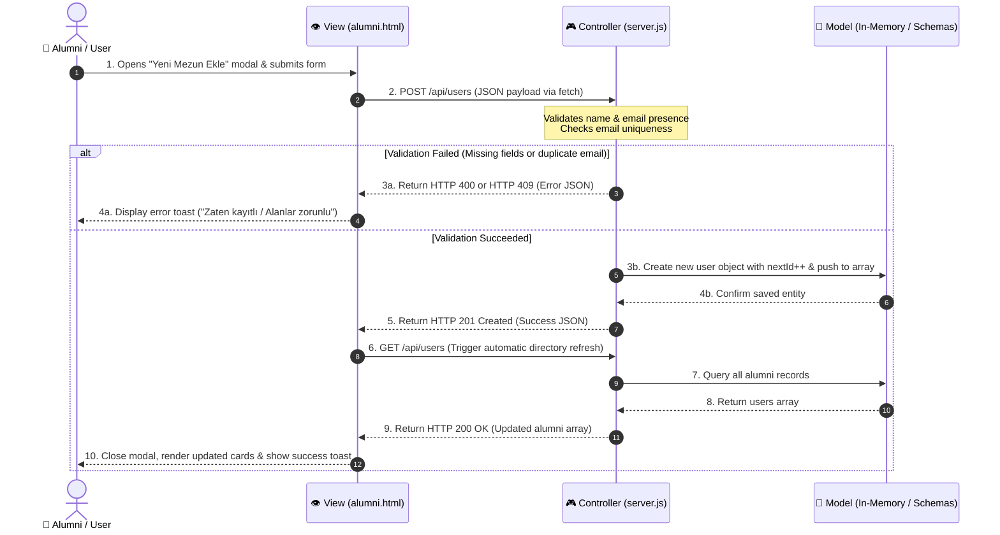
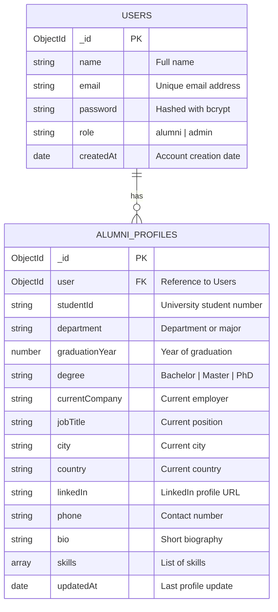

# 🎓 Alumni Tracker

A modern, containerized full-stack web application for tracking and managing university alumni. Built as a course project for **Web Programming** at Istanbul Yeni Yüzyıl University — Information Systems (YBS), 3rd Year.

---

## 🚀 Key Features & Modules

- **👤 Alumni Profiles & Career Tracking**:
  - Detailed professional profiles with current company, role, industry, and skills.
  - Academic history (graduation year, department, degree, student ID).
  - LinkedIn and portfolio integration.
- **🔍 Advanced Search & Directory**:
  - Filter alumni by graduation year, department, company, or location.
  - Paginated results with real-time search.
- **🔐 Authentication & Authorization**:
  - JWT-based secure registration and login.
  - Role-based access control (Admin / Alumni).
- **📊 Admin Dashboard**:
  - Manage all alumni records, view statistics, and generate reports.
  - User role management and verification workflows.
- **💼 Profile Management**:
  - Alumni can update their own profile and employment information.

### Planned Features
- [ ] Event management for alumni reunions
- [ ] Messaging system between alumni
- [ ] Data visualization and analytics dashboard
- [ ] Export alumni data (CSV/PDF)
- [ ] Email notifications for events and updates

---

## 🛠️ Tech Stack

| Layer | Technology | Description |
| :--- | :--- | :--- |
| **Backend** | **Node.js** + **Express.js** | High-performance RESTful API with modular route architecture. |
| **Database** | **MongoDB** (Atlas) | Flexible NoSQL document database for alumni and user data. |
| **ODM** | **Mongoose** | Schema-based data modeling and validation for MongoDB. |
| **Frontend** | **React.js** + **Vite** | Fast, modern SPA with component-based UI and hot module replacement. |
| **Auth** | **JWT** + **bcrypt** | Secure token-based authentication with hashed passwords. |
| **Containerization** | **Docker** & **Docker Compose** | Reproducible development environment with volume sync. |
| **Dev Tools** | **Nodemon** (legacy watch) | Auto-restart server on file changes inside Docker containers. |

---

## 📌 Hızlı Genel Bakış (Hoca Değerlendirme & Hızlı Erişim)

| Kontrol Alanı | Doğrudan Bağlantı / Dosya | Açıklama |
| :--- | :--- | :--- |
| ⭐ **Bu Hafta (W4)** | [Hafta 4 — MVC Mimarisi & Postman](#-hafta-4-w4--07-ekim-2026-bu-hafta--current-week-) | MVC katman analizi, dosya/klasör haritası ve test paketi |
| 👁️ **Canlı Arayüz** | [`http://localhost:5000/alumni`](http://localhost:5000/alumni) | İnteraktif mezun arama, filtreleme ve ekleme paneli |
| 📘 **Swagger UI** | [`http://localhost:5000/api/swagger`](http://localhost:5000/api/swagger) | OpenAPI 3.0 interaktif API dokümantasyonu |
| 🩺 **Health Check** | [`http://localhost:5000/api/health`](http://localhost:5000/api/health) | CPU, bellek, işletim sistemi ve çalışma süresi telemetrisi |
| 📮 **Postman Test Paketi** | [`postman/Alumni_Tracker_API.postman_collection.json`](./postman/Alumni_Tracker_API.postman_collection.json) | Tek tıkla içe aktarılabilir 14 adet API test isteği |
| 🏗️ **MVC Mimarisi** | [MVC Mimarisi ve Katman Analizi](#-mvc-architecture-model---view---controller) | Model, View, Controller detaylı teknik dokümanı |
| 📁 **Dosya Haritası** | [Proje Dizin, Klasör ve Dosya Haritası](#-project-directories-folders--files-structure) | Tüm dosya ve klasörlerin MVC sorumluluk tablosu |

---

## 📅 Haftalık Geliştirme Süreci (Weekly Progress Tracker: W1 — W4)

Bu proje, dönem boyunca haftalık aşamalarla geliştirilmektedir. Git commit geçmişi baz alınarak her haftanın hedefleri, yapılan geliştirmeler, ilgili dosyalar ve hoca kontrol notları aşağıda özetlenmiştir:

| Hafta | Tarih Aralığı | Odak & Kazanımlar | İlgili Commitler | Durum |
| :--- | :--- | :--- | :--- | :--- |
| **W1** | 22 – 23 Eylül 2026 | Proje Başlangıcı, Docker Ortamı & Express Temelleri | `d76cbcb`, `54eeece`, `6b9af53` | ✅ Tamamlandı |
| **W2** | 23 – 29 Eylül 2026 | View Katmanı Temelleri, Kurumsal UI (Home & About), Tasarım Sistemi | `e612c51` | ✅ Tamamlandı |
| **W3** | 30 Eylül 2026 | RESTful API (Users CRUD), Health Diagnostics, Swagger UI, Mezun Paneli | `cd6b3ef` | ✅ Tamamlandı |
| **W4** | **07 Ekim 2026** | **MVC Mimarisi, Dizin/Klasör Haritası, Postman Testleri & Mimari Taslak** | *(Bugünkü Commit)* | 🚀 **Bu Hafta (Aktif)** |

---

### 📦 Hafta 1 (W1) — 22–23 Eylül 2026: Proje Başlangıcı & Altyapı
* **Amaç**: Web Programlama dersi için mezun takip platformunun temel altyapısını kurmak, container mimarisini oluşturmak ve başlangıç dokümantasyonunu hazırlamak.
* **Commitler**:
  * [`d76cbcb`](https://github.com/mehmetrasid0/Alumni/commit/d76cbcb) — *Initial commit: Add README and project documentation*
  * [`54eeece`](https://github.com/mehmetrasid0/Alumni/commit/54eeece) — *feat: add Docker Compose setup and Express server with basic routes*
  * [`6b9af53`](https://github.com/mehmetrasid0/Alumni/commit/6b9af53) — *docs: redesign README with mermaid diagrams, ER schema, and phased roadmap*
* **Yapılan Geliştirmeler**:
  1. Git deposu ve `.gitignore` kural dosyası yapılandırıldı.
  2. `Dockerfile` (Node.js 18 Alpine tabanlı) ve `docker-compose.yml` yazılarak containerize geliştirme ortamı oluşturuldu.
  3. `server/server.js` dosyasında Express.js sunucusu ayağa kaldırıldı, temel yardımcı endpoint'ler eklendi (`GET /hello/:name`, `GET /sum/:number1/:number2`).
  4. MongoDB Atlas için taslak ER veri tabanı şeması ve aşamalı yol haritası (Roadmap) belirlendi.
* **İlgili Dosyalar**: `Dockerfile`, `docker-compose.yml`, `.dockerignore`, `server/server.js`, `README.md`.

---

### 🎨 Hafta 2 (W2) — 23–29 Eylül 2026: View Katmanı & Kurumsal Web Arayüzü
* **Amaç**: Kullanıcıyı karşılayan ana sayfa ve kurumsal hakkında sayfalarını modern, duyarlı (responsive) bir arayüzle geliştirmek.
* **Commitler**:
  * [`e612c51`](https://github.com/mehmetrasid0/Alumni/commit/e612c51) — *feat: add homepage UI and about page with developer info*
* **Yapılan Geliştirmeler**:
  1. **Ana Sayfa (`server/public/index.html`)**: Karşılama hero alanı, canlı platform istatistik sayaçları, özellik kartları ve aksiyon butonları tasarlandı.
  2. **Hakkında Sayfası (`server/public/about.html`)**: İstanbul Yeni Yüzyıl Üniversitesi Yönetim Bilişim Sistemleri (YBS) 3. sınıf ders projesi bilgileri, vizyon, misyon ve geliştirici biyografisi oluşturuldu.
  3. **Global Tasarım Sistemi (`server/public/css/style.css`)**: Üniversite kurumsal kimliğini yansıtan Lacivert (`--navy-900`) ve Altın (`--gold-400`) renk paleti, tipografi, flex/grid düzenleri ve mobil hamburger menü kodlandı.
  4. Express static middleware (`express.static('public')`) ile statik dosyaların sunumu sağlandı.
* **İlgili Dosyalar**: `server/public/index.html`, `server/public/about.html`, `server/public/css/style.css`, `server/server.js`.

---

### ⚡ Hafta 3 (W3) — 30 Eylül 2026: RESTful API, Health Telemetri, Swagger & Mezunlar Paneli
* **Amaç**: Mezun yönetimini sağlayan tam teşekküllü RESTful CRUD API'sini yazmak, Swagger dokümantasyonunu kurmak ve interaktif mezun yönetim arayüzünü geliştirmek.
* **Commitler**:
  * [`cd6b3ef`](https://github.com/mehmetrasid0/Alumni/commit/cd6b3ef) — *feat: Swagger API docs, health endpoint, users CRUD, alumni UI*
* **Yapılan Geliştirmeler**:
  1. **Users RESTful CRUD API**:
     * `GET /api/users` (Tüm mezunları listeleme)
     * `GET /api/users/:id` (Tekil mezun sorgulama)
     * `POST /api/users` (Yeni mezun ekleme, email benzersizlik kontrolü)
     * `PUT /api/users/:id` (Kayıt tam güncelleme)
     * `PATCH /api/users/:id` (Kayıt kısmi güncelleme)
     * `DELETE /api/users/:id` (Kayıt silme)
  2. **Multer & Form-Data Desteği**: JSON haricinde `multipart/form-data` ve `x-www-form-urlencoded` formatlarında veri alabilme özelliği eklendi.
  3. **Kapsamlı Sistem Telemetrisi (`GET /api/health`)**: CPU çekirdek yükü, sistem & işlem RAM kullanımı, işletim sistemi tipi ve uptime metrikleri hesaplanarak `healthy`, `warning`, `critical` durumlarıyla raporlandı.
  4. **Swagger UI (`/api/swagger`)**: OpenAPI 3.0 standardında interaktif API dokümantasyonu kuruldu (`swagger.js`).
  5. **Dinamik Mezunlar Paneli (`server/public/alumni.html`)**:
     * Canlı metin araması (isim, şirket, rol, email).
     * Bölüm ve mezuniyet yılına göre reaktif filtreleme.
     * Dinamik kart oluşturma motoru ve avatar initials üretici.
     * Yeni mezun ekleme modal penceresi ve asenkron `fetch()` entegrasyonu.
     * Bildirim (toast notification) geri bildirimleri.
* **İlgili Dosyalar**: `server/server.js`, `server/swagger.js`, `server/public/alumni.html`, `server/public/css/style.css`, `server/package.json`.

---

### 🚀 Hafta 4 (W4) — 07 Ekim 2026 (BU HAFTA / CURRENT WEEK ⭐)
* **Amaç**: Projenin **MVC (Model-View-Controller)** mimarisini resmileştirmek, katmanlarını ayrıştırmak, tüm dosya/klasör haritasını çıkarmak, Postman test koleksiyonuyla doğrulamak ve projeyi düzenli bir mimari taslağa kavuşturmak.
* **Odak**: Mimari Bütünlük, Katman Ayrımı (MVC), Test Otomasyonu & Proje Şablonu
* **Bu Hafta Yapılan Geliştirmeler (Hoca Değerlendirme Listesi)**:
  1. **MVC Mimarisi Analizi & Dokümantasyonu**:
     * **Model Katmanı**: `server/swagger.js` veri şemaları (User, UserInput, UserPatch) ve `server/server.js` runtime veri yönetimi/doğrulama kuralları detaylandırıldı.
     * **View Katmanı**: `server/public/` altındaki HTML5/CSS3 sayfaları (`index.html`, `about.html`, `alumni.html`) ile Swagger UI'ın sunum sorumlulukları belirlendi.
     * **Controller Katmanı**: `server/server.js` içerisindeki middleware zinciri, sayfa yönlendiricileri, CRUD handler'ları ve diagnostics controller'ı incelendi.
  2. **Dizin, Klasör ve Dosya Haritası**:
     * Projedeki tüm dizin ve dosyaların MVC rolleri (`[Model]`, `[View]`, `[Controller]`, `[DevOps]`, `[Config]`, `[Testing]`) çıkarıldı ve ayrıntılı bir Sorumluluk Matrisi tablosu oluşturuldu.
  3. **Mermaid Mimari & Sekans Diyagramları**:
     * MVC katman etkileşim şeması ile kullanıcı aksiyonundan başlayıp DB/Model güncellemesine ve arayüze dönen 10 adımlı veri akış sekans diyagramı eklendi.
  4. **Postman API Test Koleksiyonu**:
     * CRUD operasyonları, Health check, Utility ve Web page endpoint'lerini kapsayan `postman/Alumni_Tracker_API.postman_collection.json` dosyası oluşturuldu. Hoca veya geliştirici tek tıkla Postman'e import edip tüm API'yi doğrulayabilir.
  5. **Modüler MVC Geçiş Şablonu (Roadmap)**:
     * Gelecek haftalarda MongoDB Atlas ve JWT Authentication eklendiğinde projenin nasıl ayrık `models/`, `views/`, `controllers/`, `routes/`, `middleware/` klasörlerine evrileceği şablonlaştırıldı.
* **İlgili Dosyalar**: `README.md`, `Alumni/README.md`, `Alumni/postman/Alumni_Tracker_API.postman_collection.json`, `postman/collections/Alumni_Tracker_API.postman_collection.json`.

---

## 🏛️ System Architecture


```mermaid
graph TD
    User(["🌐 Web Client / Browser"]) -->|HTTP Requests| View["👁️ View Layer: Static HTML / CSS / Vanilla JS :5000"]
    View -->|REST API Calls via Fetch| Controller["🎮 Controller Layer: Express.js Routing & Handlers :5000"]
    Controller -->|CRUD & Validation| Model["🧠 Model Layer: In-Memory Store & Swagger Schemas"]
    Controller -.->|Target DB Integration| DB[("MongoDB Atlas via Mongoose")]
    Controller -->|Interactive API Docs| SwaggerUI["📘 Swagger UI: /api/swagger"]
```

---

## 🏗️ MVC Architecture (Model - View - Controller)

The **Alumni Tracker** application is designed following the **Model-View-Controller (MVC)** architectural pattern. This pattern separates the application into three interconnected components, decoupling internal representations of information from the ways that information is presented to and accepted from the user.

```mermaid
graph TD
    subgraph VIEW_LAYER ["👁️ VIEW LAYER (Client Presentation)"]
        V_Home["index.html<br/>(Landing Page)"]
        V_About["about.html<br/>(About Page)"]
        V_Alumni["alumni.html<br/>(Alumni Directory & Form)"]
        V_CSS["css/style.css<br/>(Design Tokens & Layout)"]
        V_Swagger["Swagger UI<br/>(/api/swagger)"]
    end

    subgraph CONTROLLER_LAYER ["🎮 CONTROLLER LAYER (Application Logic)"]
        C_Middleware["Middleware Pipeline<br/>(express.json, urlencoded, multer)"]
        C_ViewRoutes["View Controllers<br/>(Route to static HTML pages)"]
        C_ApiRoutes["User API Controllers<br/>(CRUD: GET, POST, PUT, PATCH, DELETE)"]
        C_Health["Diagnostics Controller<br/>(GET /api/health)"]
        C_Util["Utility Controllers<br/>(GET /hello, GET /sum)"]
    end

    subgraph MODEL_LAYER ["🧠 MODEL LAYER (Data & Schema)"]
        M_Memory["In-Memory Data Store<br/>(users array & nextId counter)"]
        M_Validation["Business Rules & Validation<br/>(Required fields, Email uniqueness)"]
        M_Swagger["OpenAPI 3.0 Schemas<br/>(User, UserInput, UserPatch)"]
        M_TargetDB[("Future: MongoDB + Mongoose<br/>(User & Alumni Schemas)")]
    end

    User(["👤 End User"]) -->|Interacts with UI| VIEW_LAYER
    VIEW_LAYER -->|Dispatches HTTP Requests| C_Middleware
    C_Middleware --> C_ViewRoutes
    C_Middleware --> C_ApiRoutes
    C_Middleware --> C_Health
    C_Middleware --> C_Util

    C_ApiRoutes -->|Queries / Validates / Modifies| M_Memory
    C_ApiRoutes -.->|Conforms to Schemas| M_Swagger
    C_ApiRoutes -.->|Target Persistence| M_TargetDB

    M_Memory -->|Returns State / Records| C_ApiRoutes
    C_ApiRoutes -->|JSON Response (200, 201, 400, 404, 409)| VIEW_LAYER
    C_ViewRoutes -->|Serves HTML Pages| VIEW_LAYER
    VIEW_LAYER -->|Renders Dynamic Cards & Feedback| User
```

---

### 🧠 1. Model Layer (Data & Schema Contracts)
The **Model** represents the core data structures, business logic constraints, and schema validations. It manages the state and rules governing alumni entities.

* **Current Implementation (`server/server.js` & `server/swagger.js`)**:
  * **In-Memory Store (`server/server.js` lines 47-55)**: Maintains runtime state via the `users` array and auto-incrementing `nextId` counter.
  * **Data Integrity & Validation Rules**:
    * Mandatory field verification: `name` and `email` are enforced on `POST` and `PUT`.
    * Unique constraint validation: duplicate email rejection (`409 Conflict`) across registration and update operations.
    * Partial vs. Full modification enforcement (`PUT` requires full payload; `PATCH` permits selective field mutation while guarding immutable identifiers like `id`).
  * **Schema Definition (`server/swagger.js`)**:
    * `User`: Complete data structure (`id`, `name`, `email`, `graduationYear`, `department`, `company`, `role`).
    * `UserInput`: Schema definition for incoming registration payloads.
    * `UserPatch`: Schema definition for selective field modifications.
    * `HealthCheckResponse`: Contract for system diagnostics telemetry.
* **Target Persistence Layer**:
  * Mongoose ODM models (`models/User.js`, `models/Alumni.js`) mapped to MongoDB Atlas collections.

---

### 👁️ 2. View Layer (User Interface & Presentation)
The **View** is responsible for presenting data to the user, capturing user interactions, and rendering visual feedback.

* **Current Implementation (`server/public/`)**:
  * **`index.html` (Landing View)**: Brand hero section, quick navigation, key university information, and statistics overview.
  * **`about.html` (Informational View)**: Project motivation, university curriculum details (Istanbul Yeni Yüzyıl University YBS), and development background.
  * **`alumni.html` (Dynamic Alumni Directory View)**:
    * **Reactive Search & Filtering**: Real-time client-side search across names, emails, companies, and roles, alongside department and graduation year select filters.
    * **Card Generator Engine**: Dynamic DOM generation converting user objects into styled card components with initials avatars and metadata tags.
    * **Modal Dialog & Form Handling**: Intercepts user inputs, formats JSON payloads, and communicates asynchronously with backend endpoints via `fetch()`.
    * **Toast Notification System**: Real-time feedback alerts for successful creation or HTTP errors.
  * **`css/style.css` (Visual Design System)**:
    * CSS Custom Properties (design tokens for colors: `--navy-900`, `--gold-400`, typography, elevation shadows, transitions).
    * Responsive CSS Grid and Flexbox layouts supporting desktop, tablet, and mobile breakpoints.
  * **Swagger UI View (`/api/swagger`)**:
    * Interactive documentation portal allowing live exploration, testing, and debugging of all API endpoints directly within the browser.

---

### 🎮 3. Controller Layer (Routing & Request Orchestration)
The **Controller** acts as the intermediate brain. It intercepts incoming HTTP requests, applies middleware processing, invokes validation on the Model, updates data, and returns the appropriate HTTP status code and response payload.

* **Current Implementation (`server/server.js`)**:
  * **Middleware Pipeline**:
    * `express.json()`: Parses incoming JSON request payloads.
    * `express.urlencoded({ extended: true })`: Handles standard form-encoded data.
    * `multer().none()`: Enables parsing of `multipart/form-data` without file storage.
    * `express.static('public')`: Serves view assets (HTML, CSS, static files).
  * **View Routing Controllers**:
    * `GET /` $\rightarrow$ Serves `index.html`
    * `GET /about` $\rightarrow$ Serves `about.html`
    * `GET /alumni` $\rightarrow$ Serves `alumni.html`
  * **User CRUD API Controllers**:
    * `GET /api/users`: Queries model for all users; returns HTTP 200 with record count and payload.
    * `GET /api/users/:id`: Extracts `:id` parameter; returns HTTP 200 or HTTP 404 with error message.
    * `POST /api/users`: Validates required fields, checks email uniqueness, creates new record, returns HTTP 201 Created.
    * `PUT /api/users/:id`: Replaces existing record, enforces all required attributes, returns HTTP 200 or 400/404/409.
    * `PATCH /api/users/:id`: Selectively modifies provided fields, validates email uniqueness if changed, returns HTTP 200.
    * `DELETE /api/users/:id`: Removes record from model collection by ID; returns HTTP 200 with deleted user info or HTTP 404.
  * **System Diagnostics & Health Controller**:
    * `GET /api/health`: Collects Node.js runtime and OS telemetry (CPU core load, memory usage, uptime, OS type, process PID) and computes status levels (`healthy`, `warning`, `critical`).
  * **Utility Controllers**:
    * `GET /hello/:name`: URL parameter greeting generator.
    * `GET /sum/:number1/:number2`: Parameterized math computation controller.

---

### 🔄 Request-Response Lifecycle Flow

The following sequence diagram illustrates how an action performed in the **View** flows through the **Controller** and **Model**, and returns updated state to the user:


```mermaid
sequenceDiagram
    autonumber
    actor User as 👤 Alumni / User
    participant View as 👁️ View (alumni.html)
    participant Controller as 🎮 Controller (server.js)
    participant Model as 🧠 Model (In-Memory / Schemas)

    User->>View: 1. Opens "Yeni Mezun Ekle" modal & submits form
    View->>Controller: 2. POST /api/users (JSON payload via fetch)
    Note over Controller: Validates name & email presence<br/>Checks email uniqueness
    alt Validation Failed (Missing fields or duplicate email)
        Controller-->>View: 3a. Return HTTP 400 or HTTP 409 (Error JSON)
        View-->>User: 4a. Display error toast ("Zaten kayıtlı / Alanlar zorunlu")
    else Validation Succeeded
        Controller->>Model: 3b. Create new user object with nextId++ & push to array
        Model-->>Controller: 4b. Confirm saved entity
        Controller-->>View: 5. Return HTTP 201 Created (Success JSON)
        View->>Controller: 6. GET /api/users (Trigger automatic directory refresh)
        Controller->>Model: 7. Query all alumni records
        Model-->>Controller: 8. Return users array
        Controller-->>View: 9. Return HTTP 200 OK (Updated alumni array)
        View-->>User: 10. Close modal, render updated cards & show success toast
    end
```

---

## 📁 Project Directories, Folders & Files Structure

The comprehensive mapping below details every directory, folder, and file across the project, identifying its exact architectural layer and purpose:

```text
alumni-tracker/
│
├── .postman/                                   # [Testing Configuration]
│   └── resources.yaml                          # Postman workspace definition & local metadata
│
├── postman/                                    # [API Testing & Verification]
│   ├── collections/                            # Automated API request test collections
│   ├── documents/                              # Supplementary API documentation & notes
│   ├── environments/                           # Postman environment variables (Local / Docker)
│   ├── flows/                                  # API workflow sequences & automation
│   ├── globals/                                # Global variable definitions
│   │   └── workspace.globals.yaml
│   ├── mocks/                                  # Mock server configurations
│   └── specs/                                  # OpenAPI / API specifications
│
└── Alumni/                                     # [Main Application Workspace]
    ├── .dockerignore                           # [DevOps] Excludes node_modules & temp files from Docker context
    ├── .gitignore                              # [VCS] Git version control exclusion rules
    ├── Dockerfile                              # [DevOps] Node.js 18 Alpine container image specification
    ├── docker-compose.yml                      # [DevOps] Multi-container orchestration, port mapping & live volume mount
    ├── README.md                               # [Documentation] Comprehensive project documentation & MVC guide
    │
    └── server/                                 # [Application Server Root]
        ├── .env                                # [Config] Environment variables (PORT=5000, NODE_ENV=development)
        ├── package.json                        # [Manifest] Project metadata, NPM dependencies & run scripts
        ├── package-lock.json                   # [Manifest] Deterministic dependency lockfile
        │
        ├── swagger.js                          # 🧠 [MODEL & SCHEMA CONTRACTS]
        │                                       # • OpenAPI 3.0 specification & Swagger UI configuration
        │                                       # • Entity schemas: User, UserInput, UserPatch
        │                                       # • Response schemas: SuccessResponse, ErrorResponse
        │                                       # • Endpoint parameter docs & HTTP status code contracts
        │
        ├── server.js                           # 🎮 [CONTROLLER & ROUTING]
        │                                       # • Express application initialization & middleware chain
        │                                       # • Runtime in-memory data store (Model representation)
        │                                       # • Page routing controllers: GET /, GET /about, GET /alumni
        │                                       # • User CRUD API controllers: GET, POST, PUT, PATCH, DELETE /api/users
        │                                       # • System health diagnostics controller: GET /api/health
        │                                       # • Utility calculation controllers: GET /hello, GET /sum
        │                                       # • Server lifecycle listener on configured PORT
        │
        └── public/                             # 👁️ [VIEW LAYER] Client-Facing Presentation
            ├── index.html                      # [View - Home] Landing page, platform highlights & call to action
            ├── about.html                      # [View - About] University, department (YBS) & project mission info
            ├── alumni.html                     # [View - Alumni] Main interactive directory:
            │                                   #   • Real-time search by keyword (name, company, role)
            │                                   #   • Department & graduation year dropdown filters
            │                                   #   • Dynamic card grid rendering with avatar initials
            │                                   #   • New alumni addition modal dialog
            │                                   #   • Toast alert notification component
            │                                   #   • Responsive mobile navigation drawer
            │
            └── css/
                └── style.css                   # [View - Styling] Global stylesheet:
                                                #   • Design tokens (Navy/Gold university palette)
                                                #   • CSS Grid, Flexbox & responsive breakpoints
                                                #   • Animations, card micro-interactions & modals
```

---

### 📊 Component Mapping & Responsibility Matrix

| Path | MVC Layer | Component Type | Primary Responsibilities |
| :--- | :--- | :--- | :--- |
| **`Alumni/server/public/index.html`** | **View** | Presentation (HTML5) | Application landing page with hero banner, feature highlights, and navigation links. |
| **`Alumni/server/public/about.html`** | **View** | Presentation (HTML5) | Department context (Istanbul Yeni Yüzyıl University YBS), project objectives, and author details. |
| **`Alumni/server/public/alumni.html`** | **View** | Interactive UI (HTML5 + JS) | Search input, filter selectors, alumni card grid rendering, modal form, and toast alerts. |
| **`Alumni/server/public/css/style.css`** | **View** | Styling (CSS3) | Design tokens, color system, typography, animations, responsive layout rules, card styling. |
| **`http://localhost:5000/api/swagger`** | **View** | API UI (Swagger) | Interactive OpenAPI 3.0 browser view for testing endpoints and inspecting model schemas. |
| **`Alumni/server/server.js`** *(Routes)* | **Controller** | Router & Handler | Dispatches HTTP requests to appropriate view loaders or REST API controller handlers. |
| **`Alumni/server/server.js`** *(CRUD)* | **Controller** | Business Logic | Validates input formats, manages HTTP status codes (200, 201, 400, 404, 409), executes CRUD operations. |
| **`Alumni/server/server.js`** *(Health)* | **Controller** | Diagnostics | Computes CPU core utilization, memory thresholds, OS metrics, and uptime statistics. |
| **`Alumni/server/swagger.js`** | **Model** | Schema Contracts | Defines formal OpenAPI data models (`User`, `UserInput`, `UserPatch`), constraints, and examples. |
| **`Alumni/server/server.js`** *(Store)* | **Model** | Runtime Data Store | Manages `users` array, field validation logic, ID autoincrement sequence, and email uniqueness checks. |
| **`Alumni/Dockerfile`** | **DevOps** | Containerization | Defines container build instructions for Node.js 18 Alpine runtime environment. |
| **`Alumni/docker-compose.yml`** | **DevOps** | Orchestration | Coordinates container startup, port forwarding (`5000:5000`), and live volume mounting. |
| **`Alumni/server/.env`** | **Config** | Environment | Stores runtime environment variables (`PORT`, `NODE_ENV`). |
| **`postman/`** | **Testing** | Verification | Houses automated Postman test suites and collections to validate controller endpoints. |

---

### 🚀 Target Modular MVC Architecture (Scaling Roadmap)

As the project expands in Phase 2 through Phase 4 (database persistence and authentication), the monolithic controller in `server.js` cleanly decomposes into modular, dedicated MVC sub-packages:

```text
Alumni/server/
├── config/
│   └── db.js                   # [Model/Config] MongoDB Atlas connection via Mongoose
├── models/
│   ├── User.js                 # [Model] Mongoose User schema & password hashing hooks
│   └── Alumni.js               # [Model] Mongoose Alumni profile schema & indexing
├── controllers/
│   ├── authController.js       # [Controller] Register, Login, JWT issuance
│   ├── alumniController.js     # [Controller] Alumni directory query, search & CRUD operations
│   ├── healthController.js     # [Controller] Health check & server telemetry
│   └── pageController.js       # [Controller] Static view serving & routing
├── routes/
│   ├── authRoutes.js           # [Routes] /api/auth routes
│   ├── alumniRoutes.js         # [Routes] /api/users & /api/alumni routes
│   └── pageRoutes.js           # [Routes] Web page routes (/, /about, /alumni)
├── middleware/
│   ├── auth.js                 # [Middleware] JWT verification & role validation
│   └── errorHandler.js         # [Middleware] Centralized HTTP error handling
├── public/                     # [View] Static views or compiled React/Vite SPA bundle
└── server.js                   # [Entry Point] Express bootstrap & middleware registration
```

---

## 🗄️ Database Schema (MongoDB)


```mermaid
erDiagram
    USERS ||--o{ ALUMNI_PROFILES : has
    USERS {
        ObjectId _id PK
        string name "Full name"
        string email "Unique email address"
        string password "Hashed with bcrypt"
        string role "alumni | admin"
        date createdAt "Account creation date"
    }

    ALUMNI_PROFILES {
        ObjectId _id PK
        ObjectId user FK "Reference to Users"
        string studentId "University student number"
        string department "Department or major"
        number graduationYear "Year of graduation"
        string degree "Bachelor | Master | PhD"
        string currentCompany "Current employer"
        string jobTitle "Current position"
        string city "Current city"
        string country "Current country"
        string linkedIn "LinkedIn profile URL"
        string phone "Contact number"
        string bio "Short biography"
        array skills "List of skills"
        date updatedAt "Last profile update"
    }
```

---

## 📡 API Endpoints

### 📘 Swagger API Dokümantasyonu

Tüm API endpoint'lerini interaktif olarak keşfetmek, test etmek ve detaylı şemalarını görmek için **Swagger UI** kullanılabilir:

| Kaynak | URL | Açıklama |
| :--- | :--- | :--- |
| **Swagger UI** | [`/api/swagger`](http://localhost:5000/api/swagger) | İnteraktif API dokümantasyonu — Try it out ile doğrudan test edin |
| **Swagger JSON** | [`/api/swagger.json`](http://localhost:5000/api/swagger.json) | OpenAPI 3.0 spesifikasyonu (JSON formatında) |

> **💡 İpucu:** Swagger UI üzerinde her endpoint'in yanındaki **"Try it out"** butonuna tıklayarak doğrudan tarayıcıdan API istekleri gönderebilirsiniz.

#### Swagger Üzerinden Test Adımları
1. Tarayıcıda [`http://localhost:5000/api/swagger`](http://localhost:5000/api/swagger) adresini açın
2. Test etmek istediğiniz endpoint'i genişletin
3. **"Try it out"** butonuna tıklayın
4. Gerekli parametreleri doldurun
5. **"Execute"** butonuna tıklayın
6. Response kısmında sonucu görün

### Health Check
| Method | Endpoint | Açıklama |
| :--- | :--- | :--- |
| `GET` | `/api/health` | Kapsamlı sistem sağlık durumu (CPU, bellek, OS, runtime bilgileri) |

### Users (CRUD)
| Method | Endpoint | Açıklama | Body Formatları |
| :--- | :--- | :--- | :--- |
| `GET` | `/api/users` | Tüm kullanıcıları listele | — |
| `GET` | `/api/users/:id` | Tek kullanıcı getir | — |
| `POST` | `/api/users` | Yeni kullanıcı ekle | JSON, form-data, x-www-form-urlencoded |
| `PUT` | `/api/users/:id` | Kullanıcıyı tamamen güncelle | JSON, form-data, x-www-form-urlencoded |
| `PATCH` | `/api/users/:id` | Kullanıcıyı kısmi güncelle | JSON, form-data, x-www-form-urlencoded |
| `DELETE` | `/api/users/:id` | Kullanıcı sil | — |

### Utility
| Method | Endpoint | Açıklama |
| :--- | :--- | :--- |
| `GET` | `/hello/:name` | `Hello,{name}!` selamlama mesajı döndürür |
| `GET` | `/sum/:num1/:num2` | İki sayının toplamını döndürür |

### Pages
| Method | Endpoint | Açıklama |
| :--- | :--- | :--- |
| `GET` | `/` | Ana sayfa (index.html) |
| `GET` | `/about` | Hakkında sayfası (about.html) |
| `GET` | `/alumni` | Mezunlar arayüzü (alumni.html) |
| `GET` | `/api/swagger` | Swagger UI — İnteraktif API dokümantasyonu |

### Örnek API İstekleri

#### Tüm Kullanıcıları Listele
```bash
curl http://localhost:5000/api/users
```

#### Yeni Kullanıcı Ekle (JSON)
```bash
curl -X POST http://localhost:5000/api/users \
  -H "Content-Type: application/json" \
  -d '{"name":"Ali Vural","email":"ali@alumni.edu","graduationYear":2023,"department":"Yazılım Mühendisliği","company":"SAP","role":"Backend Developer"}'
```

#### Kullanıcı Kısmi Güncelle (PATCH)
```bash
curl -X PATCH http://localhost:5000/api/users/1 \
  -H "Content-Type: application/json" \
  -d '{"company":"Tesla","role":"Senior Engineer"}'
```

#### Kullanıcı Sil
```bash
curl -X DELETE http://localhost:5000/api/users/1
```

---

## ⚡ Getting Started

### Prerequisites
- [Docker Desktop](https://www.docker.com/products/docker-desktop/) (includes Docker Engine & Docker Compose)
- [Git](https://git-scm.com/)

### 1. Clone & Configure Environment
```bash
git clone https://github.com/mehmetrasid0/Alumni.git
cd Alumni
```

Create a `.env` file in the `server/` directory:
```env
PORT=5000
MONGODB_URI=mongodb+srv://your_connection_string
JWT_SECRET=your_secret_key
NODE_ENV=development
```

### 2. Run with Docker Compose
Start the backend with a single command:
```bash
docker compose up -d --build
```

### 3. Service Endpoints
- **Backend API**: [http://localhost:5000](http://localhost:5000)
- **Swagger UI**: [http://localhost:5000/api/swagger](http://localhost:5000/api/swagger) — İnteraktif API dokümantasyonu
- **Swagger JSON**: [http://localhost:5000/api/swagger.json](http://localhost:5000/api/swagger.json)
- **Health Check**: [http://localhost:5000/api/health](http://localhost:5000/api/health)
- **Mezunlar Arayüzü**: [http://localhost:5000/alumni](http://localhost:5000/alumni)

### 4. Useful Commands
```bash
docker logs alumni          # View container logs
docker restart alumni       # Restart the container
docker compose down         # Stop and remove containers
```

> **💡 Live Reload:** The `server/` directory is mounted as a volume. Code changes are automatically reflected inside the container thanks to **nodemon** with legacy watch mode — no rebuild needed!

### Alternative: Run Without Docker
```bash
cd server
npm install
npm run dev
```

---

## 🗺️ Roadmap & Weekly Milestones

- [x] **Phase 1 (W1): Environment & Architecture Setup** *(Tamamlandı)*
  - Git deposu, `.gitignore` ve ilk README dokümantasyonu.
  - Node.js 18 Alpine `Dockerfile` ve `docker-compose.yml` kurulumu.
  - Express.js HTTP sunucusu ve temel yardımcı endpoint'ler (`/hello`, `/sum`).
- [x] **Phase 2 (W2): View Katmanı & Kurumsal Web Arayüzü** *(Tamamlandı)*
  - Karşılama hero alanı, sayaçlar ve özellik kartlarıyla ana sayfa (`index.html`).
  - Üniversite (İstanbul Yeni Yüzyıl Üni. YBS) ve geliştirici hakkında sayfası (`about.html`).
  - Kurumsal renk paletli duyarlı global stil sistemi (`css/style.css`).
- [x] **Phase 3 (W3): RESTful API, Health Telemetri & Swagger UI** *(Tamamlandı)*
  - Users CRUD operasyonları (`GET`, `POST`, `PUT`, `PATCH`, `DELETE /api/users`).
  - `multer` ile `multipart/form-data` ve URL-encoded veri desteği.
  - Sunucu CPU, RAM, işletim sistemi ve çalışma süresi telemetrisi (`/api/health`).
  - OpenAPI 3.0 spesifikasyonu ve interaktif Swagger UI dokümantasyonu (`/api/swagger`).
  - Anlık arama, departman/yıl filtreleme ve mezun ekleme modallı dinamik arayüz (`alumni.html`).
- [x] **Phase 4 (W4 - Bu Hafta): MVC Mimarisi & Postman Test Paketi** *(Tamamlandı ⭐)*
  - Model-View-Controller (MVC) mimari analizi ve detaylı teknik belgelendirme.
  - Tüm dizin, klasör ve dosyaların mimari rol etiketleriyle haritalandırılması.
  - Kullanıcıdan sunucuya ve arayüze veri akışını gösteren Mermaid sekans diyagramları.
  - 14 adet uçtan uca API isteği içeren Postman Test Koleksiyonu entegrasyonu.
  - Modüler MVC klasör yapısı geçiş planı.
- [ ] **Phase 5 (W5): Veritabanı (MongoDB Atlas) & JWT Kimlik Doğrulama**
  - Mongoose ODM ile User ve Alumni şemalarının bulut veritabanına bağlanması.
  - bcrypt ile şifre hashleme ve JWT token tabanlı yetkilendirme (Auth Middleware).
  - Rol tabanlı erişim kontrolü (Admin / Mezun).
- [ ] **Phase 6 (W6): Gelişmiş Mezun Özellikleri & Raporlama**
  - Mezun etkinlikleri ve buluşma yönetimi modülü.
  - Mezun listesi dışa aktarma (CSV / PDF formatları).
  - Admin istatistik ve metrik panosu.
- [ ] **Phase 7 (W7): React + Vite SPA Dönüşümü & Bulut Dağıtımı**
  - React.js bileşen mimarisi ve Vite derleyicisi ile SPA dönüşümü.
  - Docker üretim imajı derlemesi ve bulut sunucusuna (Cloud) canlı dağıtım.

---

## 🤝 Contributing

This is a university course project. Contributions are welcome for learning purposes.

1. Fork the repository
2. Create your feature branch (`git checkout -b feature/amazing-feature`)
3. Commit your changes (`git commit -m 'Add some amazing feature'`)
4. Push to the branch (`git push origin feature/amazing-feature`)
5. Open a Pull Request

---

## 📄 License

This project is licensed under the MIT License. See the [LICENSE](LICENSE) file for details.

---

## 👤 Author

**Mehmet Raşid** — Istanbul Yeni Yüzyıl University, Information Systems (YBS), 3rd Year

- GitHub: [@mehmetrasid0](https://github.com/mehmetrasid0)

---

<p align="center">
  Made with ❤️ for Web Programming Course — 2026
</p>
